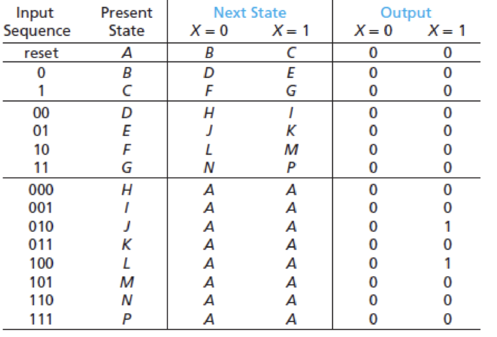

Computer Logic and Design
04-10-2025

Sequence detector: Looks at strrings of 0s and 1s. These are applied to the input X and output Y.

One method is eliminating redundant state.
In the example above, we can reduce through elmiminating redundant states
- H and I are indistinguishable.
- Similarly, rows K, M, N, and P can replaced by H and removed.
- After the first slew of replacements the new table might look like this
- Note here, after we replace I, K, L, M, N, P with H that rows F and G get changed and thus have more redundancies.