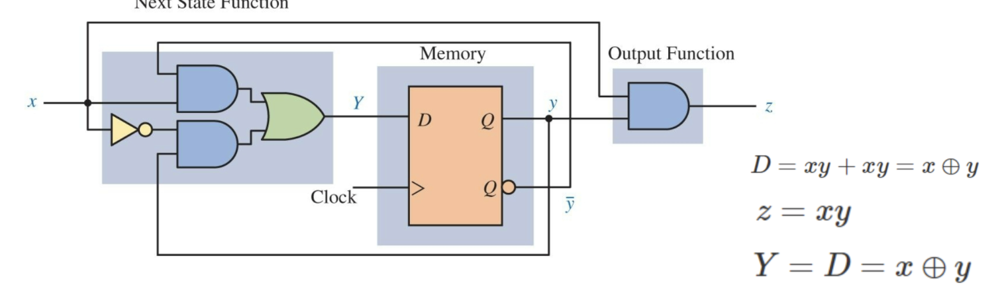
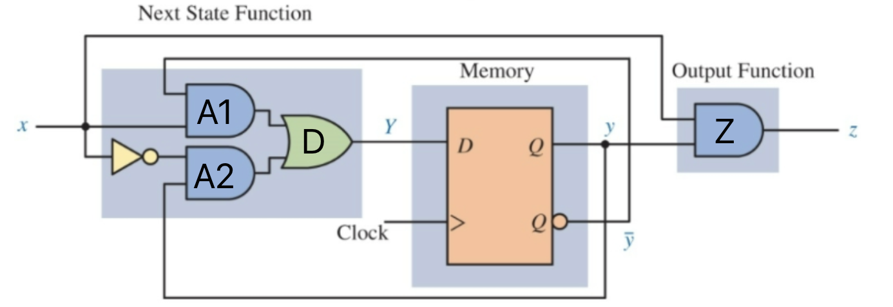
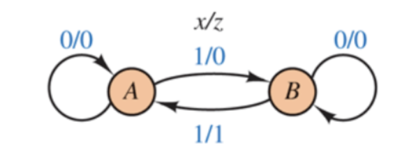
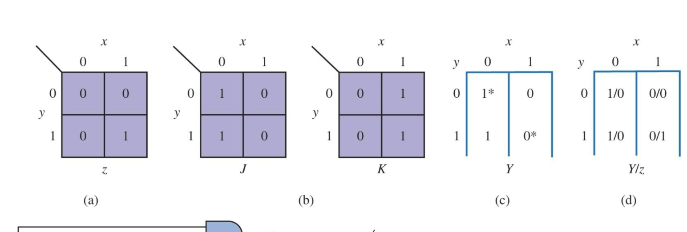
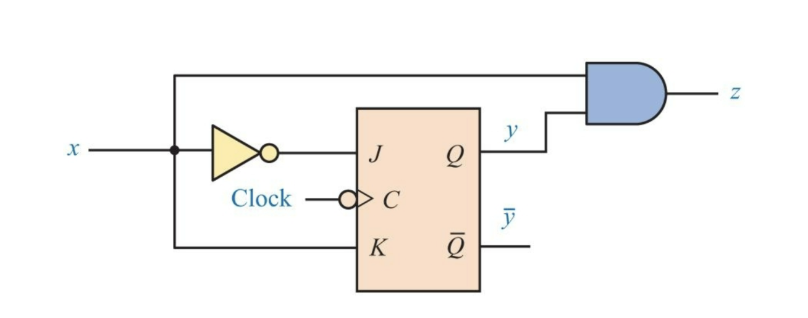

Computer Logic and Design
03-11-2025

*How to tell if a flip flop is rising or falling. If there is a not gate on the clock then the flip flop is falling and if not, then the flip flop is rising.* 



#### \*In an exam, I will be expected to determine those equations on the right.\*

We are trying to determine the output of both the flipflop and the circuit. 

- The left block is the next state function
- The middle block is the "memory element"
- All together the circuit is called a synchronous sequential circuit

The state diagram and state table for this circuit would look like this
![[State Diagram.png]]
Note the first number is the input and the second number is the output. 

#### \*For next exam will be expected to use structural and behavioral verilog\* 

### Verilog definitions
>Initial block: Procedural construct used to specify behavior that executes only once at the beginning of a simulation (used to initialize registers and variables)

Example of initial block: 
``` verilog
reg [7:0] counter;  
initial begin  
	counter = 8'h00; // Initialize counter to zero  
end 
```

>always Block: Fundamental procedural statement in Verilog that executes repeatedly based on specified events.

Example of an always block
``` verilog
always @(event_expression) begin  
	// Code to execute whenever the event occurs  
end
```
Common event expressions include:  
-  @(posedge clock) - Trigger on rising edge of clock  
-  @(negedge clock) - Trigger on falling edge of clock

>Forever Statement: Used primarily in testbenches to create an infinite loop.

Example use: 
``` verilog
forever begin  
// Code that repeats infinitely  
end
```

### Assignment types

Blocking assignment (=):
- Executes immediately when reached
- Used in procedural blocks (initial and always)
 ``` verilog
 counter = 8'h00; //intializes counter
```

Continuous assignment (assign):
- Creates a permanent connection between signals
- Used at module level (outside procedural blocks)
- Target **MUST** be a wire
``` verilog
assign sum = a + b;  // Creates a permanent connection where sum equals a+b
```

Non-blocking assignment (<=):
- Used in procedural blocks (initial and always)
- Schedules and update to happen at the end of the current time step
- Target **MUST** be a register
``` verilog
always @(posedge clk) q <= d;  // Updates q with value of d at the end of time step
```

Example tying it all together...


Verilog Code of diagram above:
``` verilog 
module Circuit5_3structural         // name of function 
	(input x, clock,               //declare input signals
    output z);                    //declare output signal
    
    wire x_not, y, y_not, d, a1, a2;   //declare internal nodes (varialbes)
    
    not (x_not, x);                         //compute x_not
    and (a1, y_not, x);                    //compute a1
    and (a2, x_not, y);                   //compute a2
    or (d, a1, a2);                      //compute d
  Dflip_flop dff( d, clock,y, y_not);   //compute y and y_not
    and (z, x, y);                     //compute z
    
endmodule
```

``` verilog
// D Flip-Flop module implementation
module Dflip_flop(
    input d,
    input clk,
    output reg q, //This is y
	output qn     //This is y_not
   
);
```

``` verilog
    // Initialize q to avoid unknown values
    initial begin
        q=0;
    end
    
    assign qn = ~q;
    
  always @(posedge clk) begin
        q<=d;  // Updates q with value of d at the end of time step
    end
endmodule

```



``` verilog 
//Circuit of Fig. 5.3, Behavioral Verilog Model
module Circuit5_3behavioral (
    input x, Clock, CLR,                     //declare input variables
    output z);                               //declare output variable
    
    reg y;                                   //declare state variable
    parameter A = 1'b0, B = 1'b1;            //make state assignment
    
    always @ (posedge Clock, posedge CLR) //detect positive edge of Clock or CLR
        if (CLR == 1) y <= A;                //go to state A if CLR is high
        else
            case (y)                   //derive next states as in state table
                A: if (~x) y <= A; else y <= B;    //transitions from state A
                B: if (~x) y <= B; else y <= A;    //transitions from state B
            endcase
            
    assign z = ((y == B) && (x == 1))? 1: 0;  //output z = f(x, y)
endmodule
```

- NOTE: CLR is shorthand for clear, a common control signal in digital circuits used to reset the circuit to a known initial state. 
- "?" in the code is shorthand for if/else...
		((y == B) && (x == 1)) ?
		- if true then z = 1
		- if false then z = 0'
Equation for a JK flip flop is:
	Q^+=JQ'+K'Q
	J, K, and z are what?
	z is xy
	x' and x so the equation then becomes x'Q'+x'Q --> x'(Q'+Q) --> x'
	So in this case for the JK flip flop the next state of Q will be x'.
	