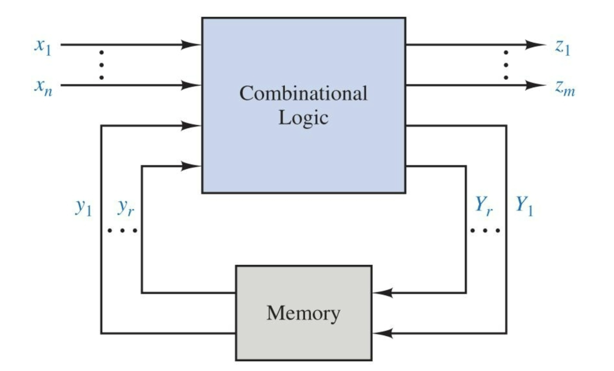
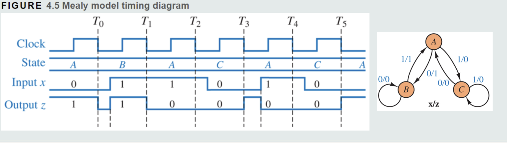
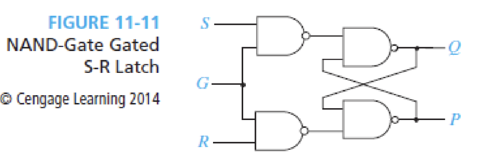
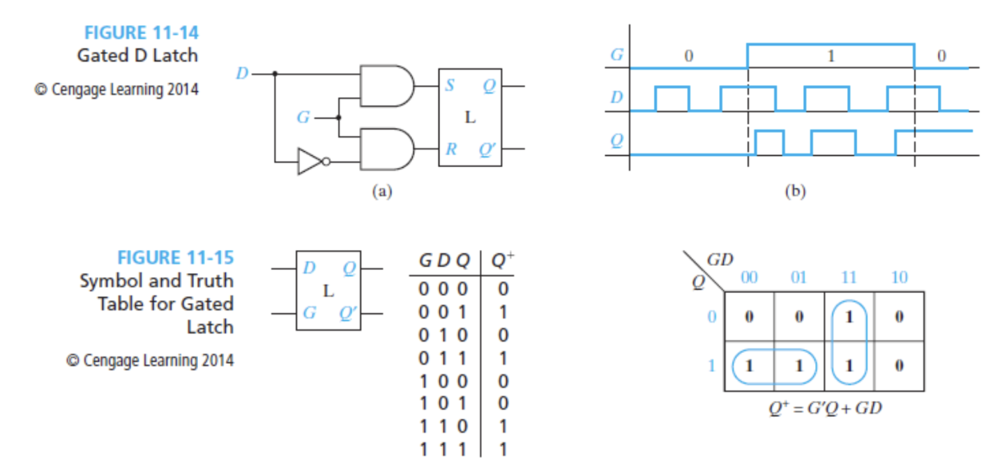

### 2025 March 4th notes 
### Computer logic and design
## Sequential logic circuit block design

The diagram illustrates the fundamental structure of a sequential logic circuit with two main components:

Combinational Logic (blue box): Receives inputs labeled x₁ through xₙ and produces outputs z₁ through zₘ.
Memory (gray box): Stores the current state of the system.

The key feature of sequential circuits is the feedback loop, where:

Current state variables (y₁ through yᵣ) feed into the combinational logic
The combinational logic produces next state variables (Y₁ through Yᵣ)
These next state variables feed back into the memory element
The memory element then updates the current state for the next cycle

This feedback mechanism is what gives sequential circuits their "memory" capability, allowing them to make decisions based not just on current inputs (like combinational circuits) but also on previous inputs and states.

#
Here is a simple example problem here:
The example input is 011010

Note that the 1/1 means a few things in this state diagram. the first number indicates which number will cause a transition and the second number is what the output state will change to. For example if state z starts at 0 and starts at state B. If x = 1 then B transitions to A as well as changing the state of Z to 1.

Also note that the state can only change depending on the falling edge of the clock cycle. For example look at T3-T4, although it seems that the state from A will go to B although it goes to C.

## Latches

This indicates a S-R latch as well as the timing diagram. What this does is it flips the output each and every time. In the table below all of the circled states are considered stable.
A stable state can run the circuit again and again and the inputs as well as the outputs remain the exact same.

if we change the value but no change in output the state is stable. if we change in input value and the output value changes the state is unstable.

A gated S-R latch is a S-R latch with an additional enable input. If enable is 0 then the states stay the same, if 1 then they are allowed to change.

The next state equation becomes
Q^+ = SG + Q(R' + G')
Where G is the enable input

The way to include this "Gate" is to use 2 more NAND gates initially as well as the enable input.

There are such latches called a D latch which essentially makes sure that if S=1 then R=0 and if S=0 Then R=1. The will never be the same

Therefore, the condition S=R=1 will never happen.

Note: if G=0 the next state will always be the same. 
if G=1 then the output will always flip

This is also reffered to as the **"transparent latch"**.

 ---
 --- 

### 3/06/2025 Computer Logic and Design Notes
## Falling edge triggered D flip flop

Falling edge D-flip flops "remember" the value between clock transitions
 

- If G = 0 then Q^+ = Q (Q will be the same value as long as the latch is inactive)
- If G = 1 then Q^+ = D or P becomes D (P is allowed to change because the latch is active)
 - A D flip flop can be constructed from two d-latches 
 - The invertor on the clock makes sure that only one of the latches are active at one time
- makes more sense when you look at the timing diagram
 ---
    Timing diagram questions will be on exam!! On the exam itself all you have to do is draw out the outuputs on the timing diagram
 ---
 

 ## Setup time
 >Setup time: The amount of time required for the input of a flip flop to be stable before the active clock edge occurs. 

 
 If setuptime is not satisfied, you might get some unstable behavior from the circuit.

 - In (b) FlipFlop delay + Inverter delay + setup time = 10ns. The total clock lasts for 9ns.
 Total time < total delay so there will be issues.

 ## S-R flip flops timing diagram example

 

 at t1, S1=S=1; R1=R=0; P = 1, S2 = 0, R2 = 1, so therefore Q = 0 and Q' = 1

 ## J-K flip flop timing diagram example

 

- JK is the same as a S-R flip flpo but the forbidden output is allowed. (Q^+ = Q')

(Q^+) = J Q'+K' Q

## T Flip Flop

- The main difference with a T flip flop is it has a toggle input. When toggle is 1 then the clock signal is applied. If toggle is Low then the clock signal is not applied
