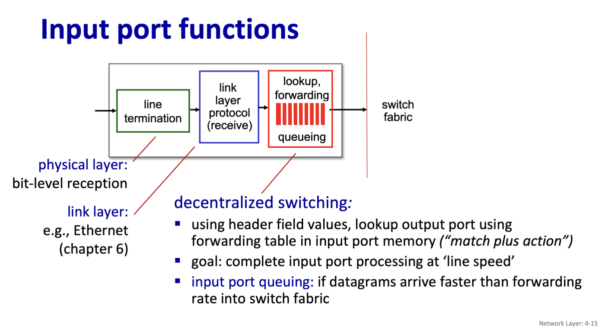
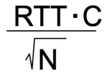
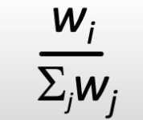
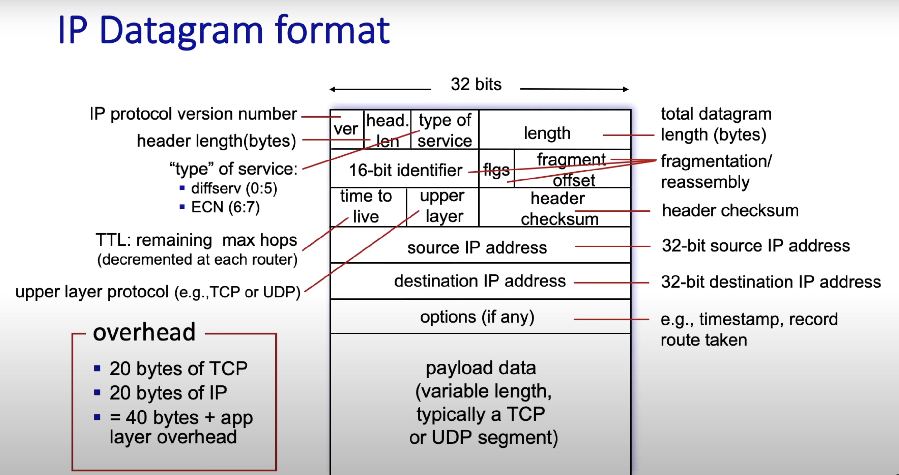
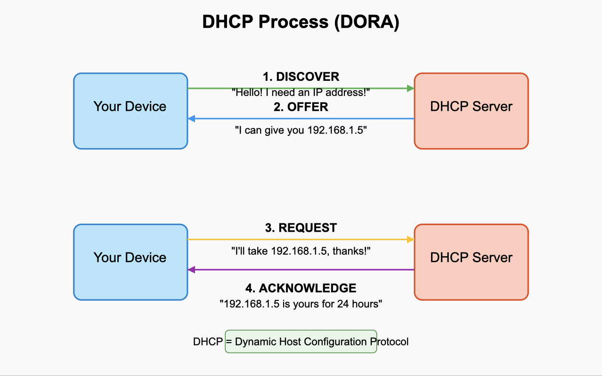
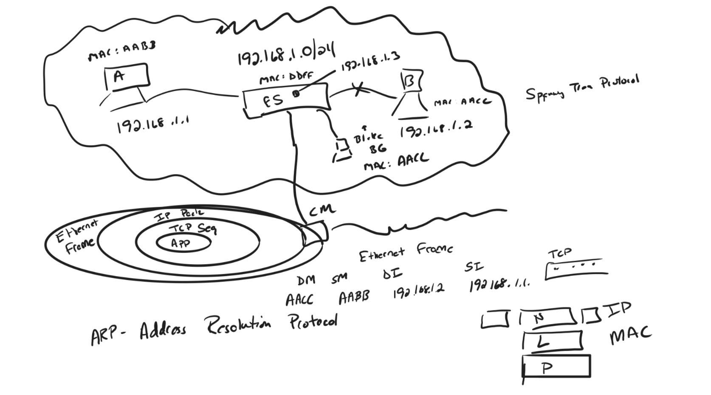
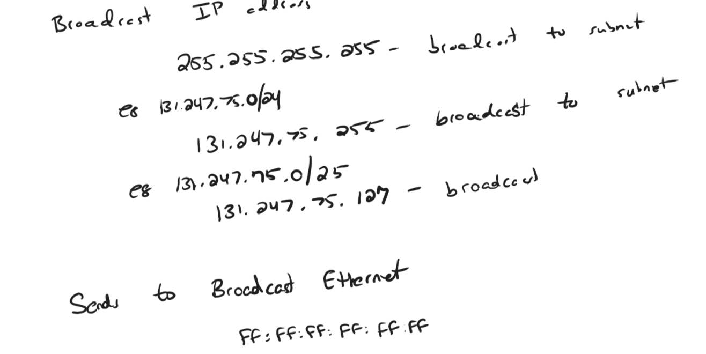
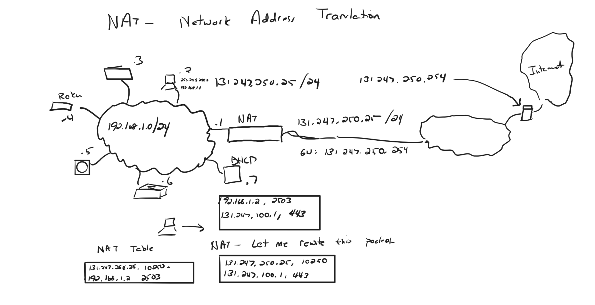
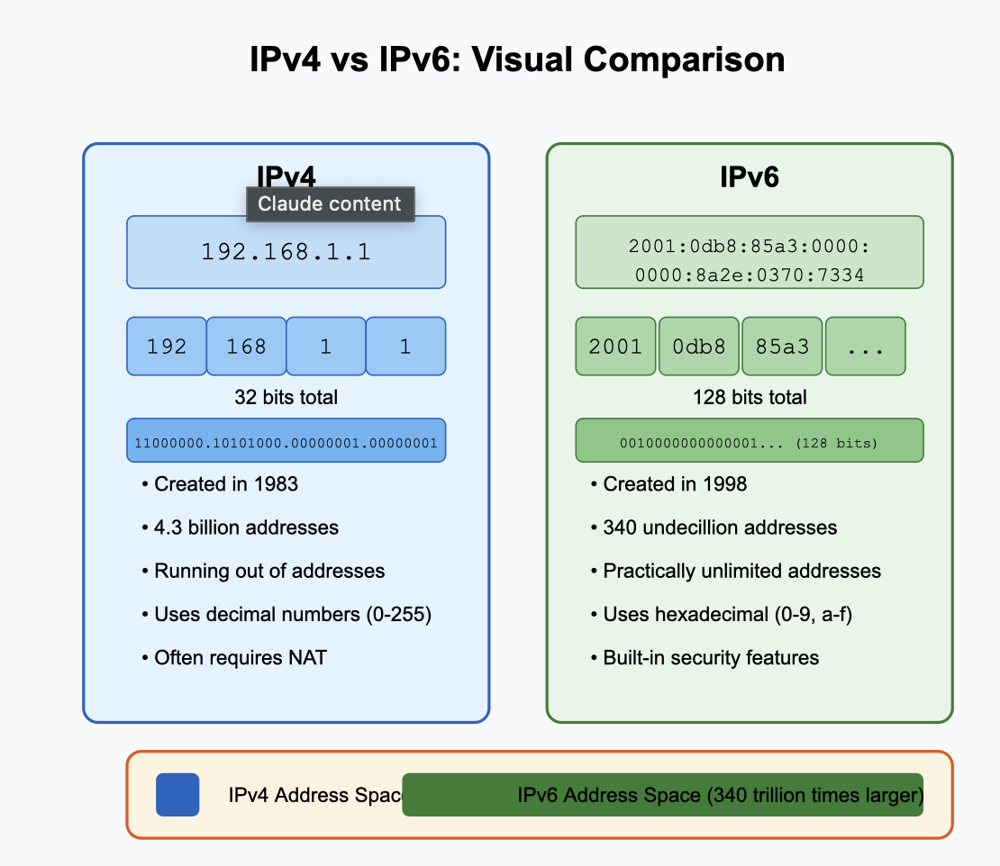
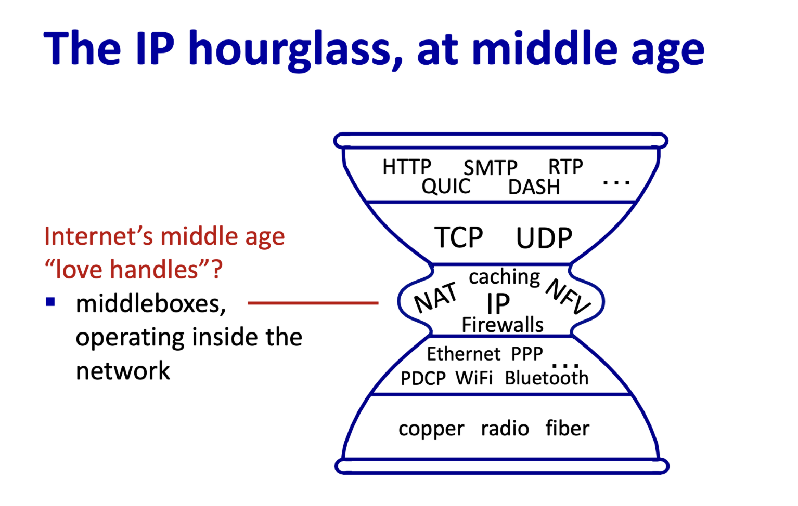

## 2025 March 3/04/25 Computer networks
Section 4 network layer

Inside of a router it is designed such where there are input ports switch fabric and output ports.

The input port is designed left to right as such

1) **Line termination**. The phyiscal means of how data is being transfered into the input 
2) **The link layer protocol**. This could be IPv4, IPv6 ect. but is essentially the protocol used to transmit the data.

3) **Generalized forwarding**. How the router determines where to send the data.

### Destination based forwarding 
Destination based forwarding use forwarding tables to determine where to send the data. This usually works with each section having a specific range of binary values. If it falls within that value then the data will link to whichever given interface.

A faster way/workaround used is longest prefix mathcing which, instead of a given range, the forwarding number will be linked to whichever has the longest matching prefix.

### Switching fabric

- Transfers packet from input link to the appropriate output link.

- The fabric has a swithcing rate.

- If data is switched via a bus, skips the intermediate transfer between memeory and in turn, is faster. A packet only has to pass through the bus or the pack plane once.

### input port queueing

- If more packets arrive in a unit time than the switching fabric can output the inputs, then there is a queue. 

- **Head of the line blocking**: Packets at different input ports want to go to the same output port.

### Output port
- Essentially the same thing as the input port but flipped.
- There needs to be queuing if multiple packets arrive at the same time. 
- Scheduling dicipline: the router knows which packets that are queued should be prioritized for transmission.

**Buffering formula** 

TCP senders will be slower to detect

When packets are recieved out of order there are different types of packet scheduling. 

### Different types of packet scheduling

- FCFS scheudling is first in first out. 
- There are also priority queues. The network operator or the ISP is who gets to choose what is priority and what isn't.
- Round robin scheduling classifies packets into different classes and then is queued by class.  
- - In round robin queuing there is weighted fair queuing (WFQ) where each class can recieve a different amount of service according to the formula below. This ensures that there is at least some bandwidth gauranteed to each class.

- - 

Network Neutrality
ISPs should enable access to all content and applications regardless of the source w/o favoring or blocking a particular site

### The internet protocols
 IPv4 Datagram format
 

 IP addresses are 4 - 8 bit numbers

 xxxxxxxx - xxxxxxxx - xxxxxxxx - xxxxxxxx
 
 223.1.1.1 for example is:

 11011111 - 00000001 - 00000001 - 00000001

---
---

 ## 3/06/25 Notes
 ### Doing 3/04s notes as well as finishing chapter 4 and maybe starting chapter 5

---
## DHCP
 - DHCP stands for Dynamic Host Configuration Protocol. 
 - It gives IP addresses to devices on a network automatically. Without DHCP, you would need to set up each device's network settings by hand.
- Basically a template that sets up IP for newly configured networks
- Has 4 way packet exchange in its protocol.

-- DORA --

 D - discovery
 
 O - Offer
 
 R - Request 
 
 A - ACK

 
 ---

 
 The reason DCHP is so good is:
 1)  that you dont have to set up the network yourself. 
 
 2) It makes it easier to introduce new devices to the network

 3) IP addresses get recycled when devices leave the network
 
 4) Network changes can be made in one place instead of on every device

 ---

 Important DHCP Terms:

>IP Address: A number that identifies your device on a network (like 192.168.1.5)

> DHCP Server: The computer that hands out IP addresses

>Lease Time: How long you can keep an IP address before asking for it again

> DHCP Scope: The range of IP addresses the server can give out

> Gateway: The router address that connects your network to other networks

> DNS Server: The address of servers that convert website names to IP addresses

---

DHCP Real life example:

- Most home routers include a DHCP server. When you connect a new phone or laptop to your Wi-Fi, it gets an IP address from this DHCP server automatically. This is why you can connect new devices without any network setup.

---
---

Whiteboard notes that I missed (Catchup from 3/04/25):

---
 ## ARP
- ARP (Address Resolution Protocol) - The middle section shows how ARP works to map IP addresses to MAC addresses within a network. There's a diagram showing devices labeled A, B, and C with their corresponding IP addresses (like 192.168.1.1) and how ARP resolves these to physical addresses.

Computers have 2 addresses. The MAC address and the IP address. If you want to send data from your computer, you need both addresses. 

ARP Works like this:

- Computer A wants to talk to Computer B but only knows its IP address
- Computer A shouts to everyone on the network: "Who has IP 192.168.1.10? Tell me your MAC address!"
- Computer B answers: "That's me! My MAC address is 00:1B:2C:3D:4E:5F"
- Computer A remembers this information in its "ARP cache" (like a contact list)
- Now Computer A can send messages directly to Computer B

---

--- 

IP Addressing and Broadcasting - The notes explain different broadcast address formats:

255.255.255.255 (broadcast to subnet)
Examples with 131.247.x.x addresses showing broadcast to router
Notes about broadcast Ethernet with FF:FF:FF:FF:FF:FF (the MAC broadcast address)

---

## NAT (Network Address Translation)

All devices on a NAT network all share the same IPv4 address as far as the outside world is concerned

NAT acts as a translator between your private home/office network and the public internet. It performs two main functions:

Address Conservation: Allows many internal devices (with private IP addresses like 192.168.1.x) to share one or a few public IP addresses

Security: Provides a basic form of firewall protection by hiding internal network addresses

NAT works by recieves a request from your internal network and uses a NAT table to replace the source address with its own public IP address.

In class diagram which demonstrates this: 

---

RFC 1918 - A reference to the standard that defines private IP address spaces

--- 
## Todays content

Differente link layer protocols have different MTU (Maximumum terminum unit)

The switch from IPv4-> IPv6: 

- IPv6 motivation was because we were running out of 32 bit address spaces, each address was about to be completely used.

## IPv4:

The original internet address system created in 1983
- Uses 32 bits to create addresses that look like 192.168.1.1
- Can only create about 4.3 billion unique addresses
- We're running out of these addresses as more devices connect to the internet
- Uses dots to separate numbers, and each section is 0-255

 IP addresses are 4 - 8 bit numbers

 xxxxxxxx - xxxxxxxx - xxxxxxxx - xxxxxxxx
 
 223.1.1.1 for example is:

 11011111 - 00000001 - 00000001 - 00000001

## IPv6:

- The newer address system created to solve the shortage problem
- Uses 128 bits to create addresses that look like 2001:0db8:85a3:0000:0000:8a2e:0370:7334
- Can create 340 undecillion addresses (that's 340 with 36 zeros after it!)
- Has enough addresses for every grain of sand on Earth to have many addresses
- Uses colons to separate sections and uses hexadecimal numbers (0-9 and a-f)

---

The world we live now is a hybrid of IPv4 and IPv6

Today, we can use one link layer and use both IPv4 and IPv6 on the same layer

Some routers are IPv4 and some are IPv6. Some are even both. For everything to work in the modern world we need both to work. If we are sending something through an IPv4 router, we need to encapsulate the datagram so that IPv6 can read it.

>Encaspulation: Putting an IPv4 packet into an IPv6 packet through compression and having the router uncopmress the IPv4 file thus making the two compatible on the same network.

---

## Middle Boxes

A middlebox are devices that sit in the middle of the network which performs different tasks.

### Common Types of Middleboxes

Firewalls

- Act like security guards for your network
Block suspicious activity and unauthorized access
Example: The security features in your home router
- Checks things such as source, destination, TCP destination, source destination, ect.
- would work like if host = B, TCP dest = 80, SRC = Internet, then DROP.

NAT (Network Address Translation) Devices

- Allow multiple devices to share one public IP address
Hide your private network from the outside world
Example: Your home router does this

Load Balancers

- Distribute traffic across multiple servers
to prevent any single server from becoming overwhelmed

    Example: Used by Netflix to handle millions of viewers
- Essentially sends traffic to multiple different hosts.

## IP hourglass

*Chapter 4 complete*

## Chapter 5 of the book:
## Routing protocols
- Determines which paths are "good" from sending to recieving hosts. 
- "good" could mean fastest, cheapest, least congested, ect.    
- There comes a level of politics where countries could restict network flow to other places.