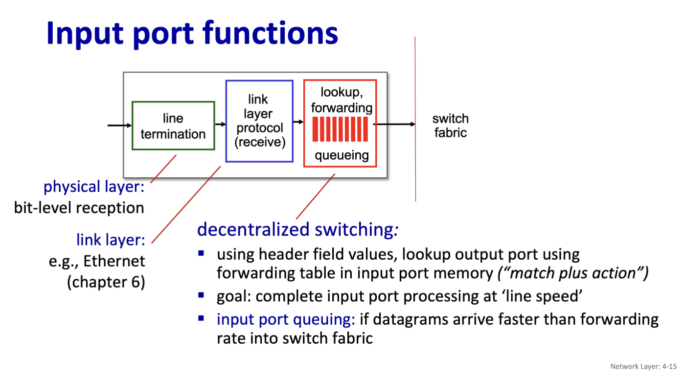
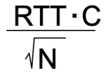
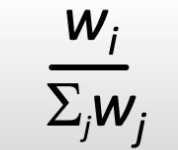
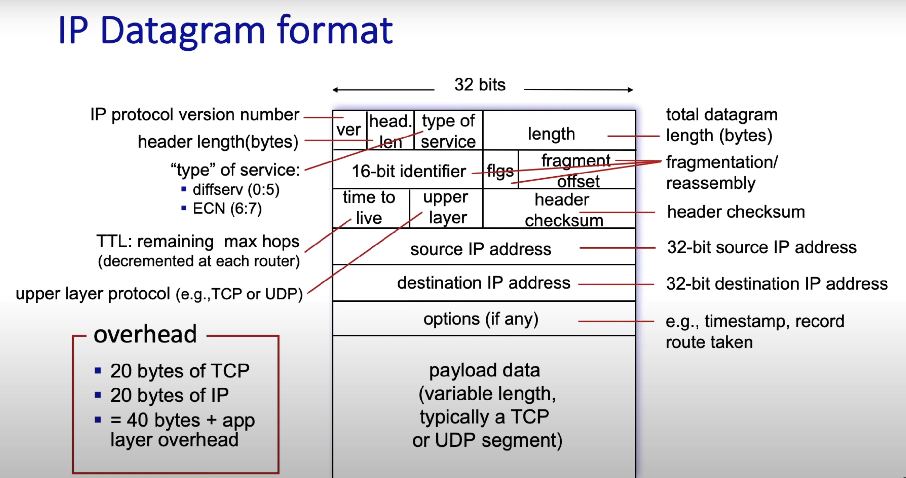

## 2025 March 3/04/25 Computer networks
Section 4 network layer

Inside of a router it is designed such where there are input ports switch fabric and output ports.

The input port is designed left to right as such

1) **Line termination**. The phyiscal means of how data is being transfered into the input 
2) **The link layer protocol**. This could be IPv4, IPv6 ect. but is essentially the protocol used to transmit the data.

3) **Generalized forwarding**. How the router determines where to send the data.

### Destination based forwarding 
Destination based forwarding use forwarding tables to determine where to send the data. This usually works with each section having a specific range of binary values. If it falls within that value then the data will link to whichever given interface.

A faster way/workaround used is longest prefix mathcing which, instead of a given range, the forwarding number will be linked to whichever has the longest matching prefix.

### Switching fabric

- Transfers packet from input link to the appropriate output link.

- The fabric has a swithcing rate.

- If data is switched via a bus, skips the intermediate transfer between memeory and in turn, is faster. A packet only has to pass through the bus or the pack plane once.

### input port queueing

- If more packets arrive in a unit time than the switching fabric can output the inputs, then there is a queue. 

- **Head of the line blocking**: Packets at different input ports want to go to the same output port.

### Output port
- Essentially the same thing as the input port but flipped.
- There needs to be queuing if multiple packets arrive at the same time. 
- Scheduling dicipline: the router knows which packets that are queued should be prioritized for transmission.

**Buffering formula** 

TCP senders will be slower to detect

When packets are recieved out of order there are different types of packet scheduling. 

### Different types of packet scheduling

- FCFS scheudling is first in first out. 
- There are also priority queues. The network operator or the ISP is who gets to choose what is priority and what isn't.
- Round robin scheduling classifies packets into different classes and then is queued by class.  
- - In round robin queuing there is weighted fair queuing (WFQ) where each class can recieve a different amount of service according to the formula below. This ensures that there is at least some bandwidth gauranteed to each class.

- - 

Network Neutrality
ISPs should enable access to all content and applications regardless of the source w/o favoring or blocking a particular site

### The internet protocols
 IPv4 Datagram format
 

 IP addresses are 4 - 8 bit numbers

 xxxxxxxx - xxxxxxxx - xxxxxxxx - xxxxxxxx
 
 223.1.1.1 for example is:

 11011111 - 00000001 - 00000001 - 00000001