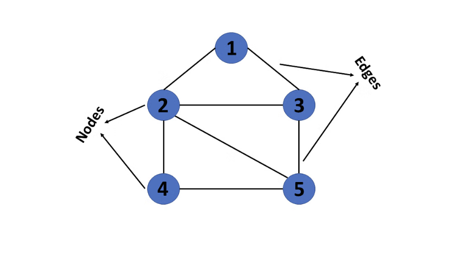
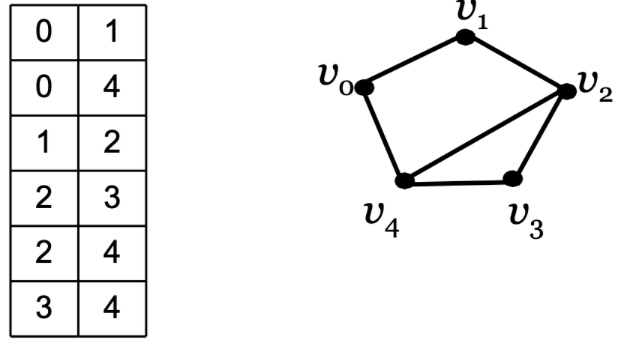
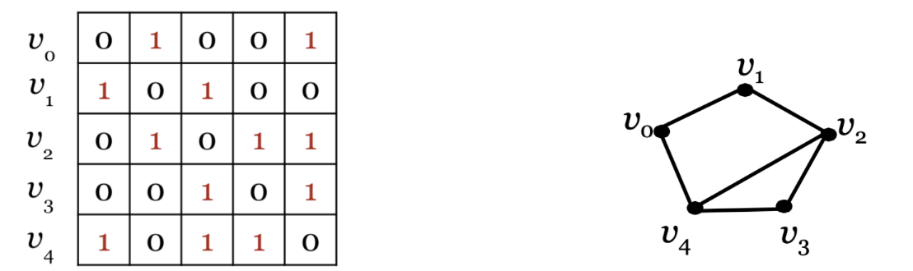
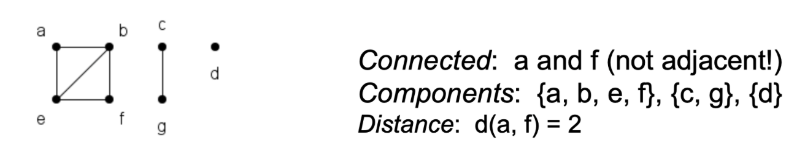
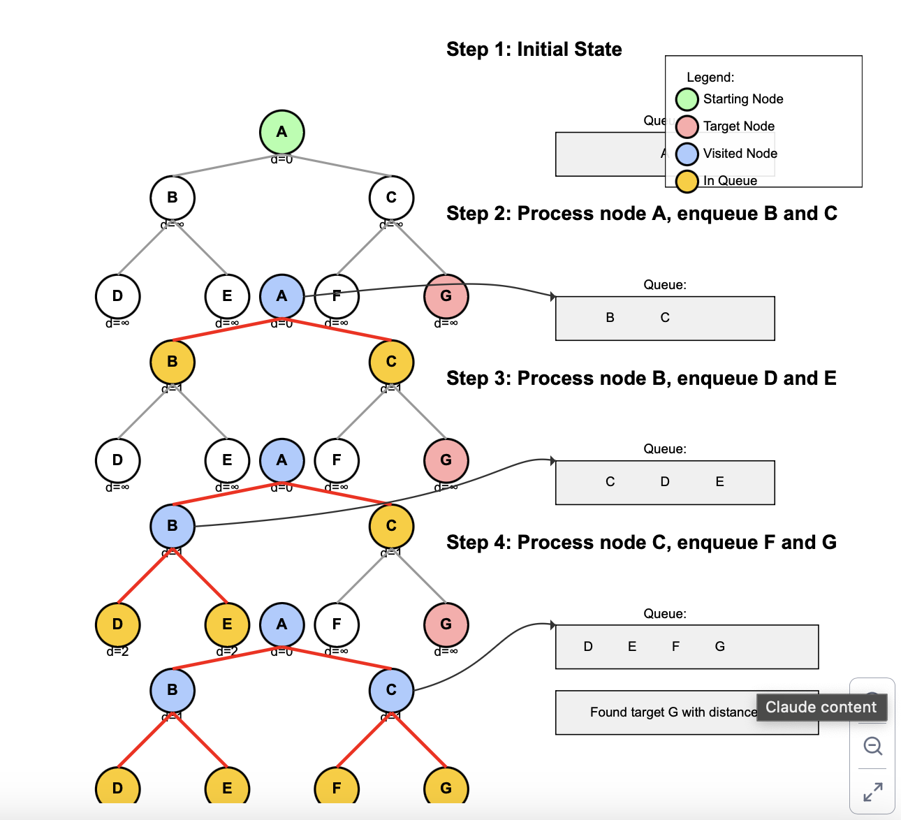
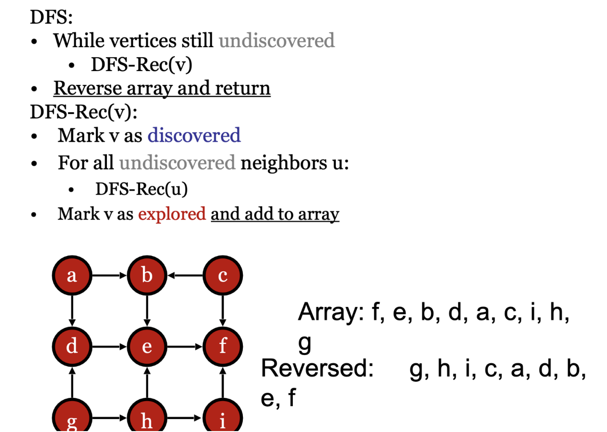

Data Structures
04-21-2025

### Overview 
Graphs in the context of data structures are networks of relationships
- contains a set of n objects 
- has V vertices (just like a node!!)
- has E edges which connect two vertices together
Examples of data structure graphs are
- The internet
- Social media 
- Topology networks: roads, computer networks, etc. 
### Essential terminology
- Order: the number of vertices in the graph (n or v)
- Size: number of edges in the graph (m or e)
- Max # of edges: ($^n _2$) = O(n$^2$) 
- Adjacent: Two vertices connected with an edge
- Incident: Vertex and an edge where the vertex is an endpoint
- Degree: The number of vertices adjacent to a given vertex (deg(v))


How can we represent a graph as a data structure?
Four notable represntations:
1. Edge list
2. Adjacent matrix
3. Adjecent list 
4. Incidence matrix 

### Edge list
>Represent all of the edges in the graph

- May be sorted or unsorted 
- Edges must be undirected meaning that there is no direction of edges between nodes. If there was a direction V$_0$ --> V$_1$  but not V$_1$ --> V$_0$ 


#### Edge list operations:
-  AddVertex()  
	- Increment order  
	-  O(1)  
- RemoveVertex(v)  
	- Scan list  
	- Remove all edges with v  
	- O(m)  
- AddEdge(u, v)  
	- Append (u, v)  
	- O(1)  
- RemoveEdge(u, v)  
	- Remove (u, v)  
	- O(m)  
- IsAdjacent(u, v)  
	- Scan list for (u, v)  
	- O(m)  
- GetNeighbors(v)  
	- Scan list for (v, *) or (*, v)  
	- O(m)

### Adjacency Matrix 
- We have an n by n matrix
- If two given vertices are adjacent, then it is denoted by a 1 and 0 otherwise.

- Note if the matrix is always symmetrical for undirected graphs...
	- Therefore you only need to store the lower triangle of the matrix to optimize the matrix
- Also adjacency matrices can support weight (the "cost" of links). Instead of putting just 1 to indicate adjacency just use the cost of the link instead.
#### Adjacency matrix operations: 
- AddVertex()  
	- Add row and column to matrix  
	- O(n2) or O(n)  
- RemoveVertex(v)  
	- Remove row and column from matrix  
	- Shift elements left or up  
	- O(n2)  
- AddEdge(u, v)  
	- a$_u$$_v$ = a$_u$$_v$ = 1  
	- O(1)  
- RemoveEdge(u, v)  
	- a$_u$$_v$  = a$_u$$_v$  = 0  
	- O(1)  

### Graph traversal 
#### Terminology 
- Walk: Sequence of vertices joined by edges
	- if directed must obey directionality of edge
	- The length of a walk is the number of edges (This could be infinite because can loop over the same vertices and edges)
- Path: walk with no repeated vertices or edges
- Circuit: walk that begins and ends at the same vertex (A.K.A a closed walk)
- Cycle: nontrivial path that begins and end at the same vertex
	- Not the difference from a cycle and ciruit is that a circuit is a wzalk and a cycle is a path
- Connected: two vertices that have a path between them
- Component: Maximal set of connected vertices in a graph
	- Maximal = cannot be enlarged by adding more vertices
	
#### BFS
Breadth first search (BFS)
- Queue-based traversal  
- Resembles level-wise BinarySearchTree traversal  
- Start at first vertex and add to queue  
- Dequeue vertex and add unvisited neighbors to queue  
- Continue until queue is empty  
- If there is more than one component, repeat on next
The psuedo code works as followed:
1.  Mark all vertices as undiscovered  
2. Add node to queue  
3. Mark node as discovered  
4. While queue is not empty:  
	- Dequeue vertex v  
	- Mark v as explored (optional)  
	- Enqueue undiscovered neighbors of v   
	- Mark those neighbors as discovered  
5. If any vertex still undiscovered, choose one and restart
[Visual representation of BFS](https://visualgo.net/en/dfsbfs)
The idea is you want to explore all of your neighbors before looking at other neighbors neighbors

#### DFS
Depth first search (DFS)
- recursive algorithm 
	- simpler than BFS 
	- Resembles pre-order in BST
		- Remember: Pre-order was printing/processing the node first then progressing right down the tree and then right.
	- Works by:
	1. Marking all vertices as undiscovered
	2. Call DFS recursively 
	3. If a vertex has no neighbors left that are undiscovered it is popped from the stack
	4. If any vertex is still left undiscovered then choose one and restart
Note: We know the algorithm is finished when the call stack has nothing left in it.
- In simple terms DFS starts with the root node and places its neighbors in a queue. Then it recursively goes to each neighbor in the stack. Then when no more neighbors are left, then nodes are recursively processed and then popped from the stack. When the stack is empty, the algorithm is finished. 
- [Visual algo of DFS](https://visualgo.net/en/dfsbfs)

#### DFS vs. BFS: Understanding the Differences

## Basic Concepts

**Depth-First Search (DFS)**

- Goes as deep as possible along one branch before backtracking
- Like exploring a maze by following one path until you hit a dead end
- Uses a stack data structure (or recursion)
- Explores far away nodes first

**Breadth-First Search (BFS)**

- Explores all neighbors at the current depth before moving deeper
- Like ripples spreading out from a stone dropped in water
- Uses a queue data structure
- Explores nearby nodes first

## Key Differences

1. **Memory Usage**:
    - DFS typically uses less memory for wide graphs
    - BFS can use a lot of memory if the graph is wide (many neighbors)
2. **Path Finding**:
    - DFS doesn't necessarily find the shortest path
    - BFS always finds the shortest path (in unweighted graphs)
3. **Completeness**:
    - DFS might get stuck in infinite paths (if not tracking visited nodes)
    - BFS will always find a solution if one exists

## When to Use Each Method

**Best Applications for DFS**:

- Maze solving
- Puzzle games
- Detecting cycles in graphs
- Topological sorting (for scheduling or dependency problems)
- Finding connected components in a graph
- When memory is limited and the solution is far from the start

**Best Applications for BFS**:

- Finding the shortest path
- Social network connections (finding friends of friends)
- GPS navigation systems
- Web crawlers
- Testing if a graph is bipartite
- When the solution is likely close to the starting point

BFS is better when you want to find something close to where you start. DFS is better when you need to explore all possibilities or when solutions might be far away.

#### Application
What if we wanted to find out the distance between two nodes in a graph?

To find the distance between two nodes in a graph, you'd typically use BFS (Breadth-First Search). Here's a simple explanation of how to do it:

1. Start BFS from the first node.
2. Use a queue to keep track of nodes to visit.
3. Also keep an array called "distance" that stores how far each node is from the start.
4. Initialize all distances to infinity, except the starting node which has distance 0.
5. For each node you visit:
    - Check all its neighbors
    - If a neighbor hasn't been visited yet, mark its distance as (current node's distance + 1)
    - Add the neighbor to the queue
6. Continue until you either find the target node or the queue becomes empty.
7. When you reach the target node, its distance value is the shortest path length.

The code looks like this:

``` cpp
int findDistance(vector<vector<int>>& graph, int start, int end) {
    int n = graph.size();
    vector<int> distance(n, -1);  // -1 means not visited
    queue<int> q;
    
    // Start BFS from the start node
    distance[start] = 0;
    q.push(start);
    
    while (!q.empty()) {
        int current = q.front();
        q.pop();
        
        // If we reached the end node, return its distance
        if (current == end) {
            return distance[current];
        }
        
        // Check all neighbors
        for (int neighbor : graph[current]) {
            if (distance[neighbor] == -1) {  // If not visited
                distance[neighbor] = distance[current] + 1;
                q.push(neighbor);
            }
        }
    }
    
    // If there's no path between start and end
    return -1;
}
```



Another example is topilogical sorting which deals with graphs that have direction:
Here is the graph here
