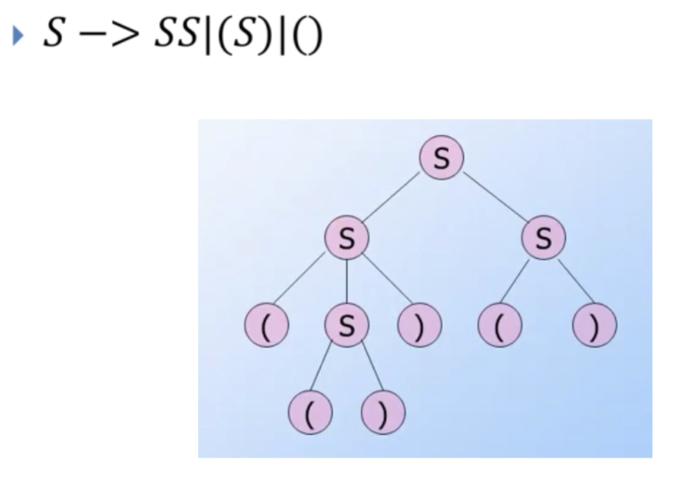

Automata and Language theory
03-07-2025

> Context free language: A language generated by some context free grammar

Context free grammars are identified by four-tuples:
- V = set of variables 
- Σ = set of transitions
- S = start symbol
- P = productions rule
**Example**
		- For generating a language that generates an equal number of a's and b's in the form a$^n$b$^n$, the context free grammar will be defined as:
			G = {(S, A) , (a, b), (S -> aAb, A  -> aAb | ϵ)}
		The context free grammar would be 
			S -> aSb | ab
			note that ab is the basis case 
		 The reason this works is because if we take the productions up here:
		 (S -> aAb, A  -> aAb | ϵ)} we can generate the strings described in the problem.
		 i.e 
			 S-> aAb
			 A -> aaAbb (the A is replaced wit aAb as stated in the production)
			 A -> aaaAbbb 
			 A -> aaaϵbbb (the production has the choice of going ϵ or aAb)
			 A -> aaabbb (<-------- this is an example string within the language)
		
		  
**More difficult example**
	 - Language {ww$^R$: wϵ {a, b} \*}
	- Example strings: aabaa aba aaabbbaaa aabaabaa
	 Answer: S -> aAa | bAb | ϵ
	 

>Derivation:  You can derive a CFG from an example string and production rules

**Example:**
	S -> aS -> aaS -> aabA -> aab
So the context free language might look like 
 - S -> aS | bA | ϵ
 - A -> ϵ

**More difficult example**
	S -> ( ) ;  S -> (S) ; S -> SS; == ( S -> ( ) | ( S ) | SS | ϵ )
	Which of these strings are not from the language defined by this CFG
1) (()())()
2) ((())()(()))
3) ((()(())()
4) ()()()()

The key to solving a problem like this is understanding the behavior of the language, seeing which micro strings are possible and which aren't.

4 is made by S -> SS -> SSS -> SSSS then SSSS -> ()()()()
1 is made from S -> SS -> SS -> (S)S -> (SS)S -> (()())()
2 is made from S -> (S) -> (SS) -> ((S)S)-> ((S)SS) -> ((S)S(S)) -> ((())()(()))
3 is not possible just from the nature of the language 

**Types of Derivations**
There are two common ways to perform derivations:
- **Leftmost derivation**: Always replace the leftmost non-terminal first
- **Rightmost derivation**: Always replace the rightmost non-terminal first

### Parse trees 
>Parse trees: Trees labeled by symbols of particular CFG

- Leaves: Labeled by a terminal or λ.
- Root: Start symbol
Example of a Parse tree

### Ambiguity 
A CFG is *ambiguous* if there is a string in the language that is the yield of two or more parse trees. In other words there is more than one way to make the same string. 
i.e
	S-> SS -> SSS -> ()()() 
	or 
	S->SS ->()S -> ()SS -> ()()()
Thus this CFG is ambiguous.

> Note that ambiguity is a property of grammars **NOT** languages. 

There is a such a thing as an unambiguous grammar which has strings which are only derivable a single way.

An example is:
	B-> (RB| λ
	R-> ) | (RR
Example derivation:

B-> (RB -> (R(RB -> ()(RB -> ()() λ -> ()()
^ This derivation is the **ONLY** way to arrive at ()()

### S-Grammar 
>S-Grammar: Any Context free Grammar where all of its productions look like:
>	A -> ax

They are very easy to understand and very easy to implement.
Simple grammars 
1) Start with a terminal symbol (a, b, c)
2) Are easy to read because you can easily tell which rule to apply by looking at the first symbol
3) There's no confusion about which rule to choose
**For example**
- S -> aS | bSS | c
**Non example**
- S -> aS | aSS| bSS | c
- This is a non example because:
	- Two different rules start with 'a' (aS and aSS)
	- When you see an 'a', you don't immediately know which rule to apply
	- This creates ambiguity in the parsing process