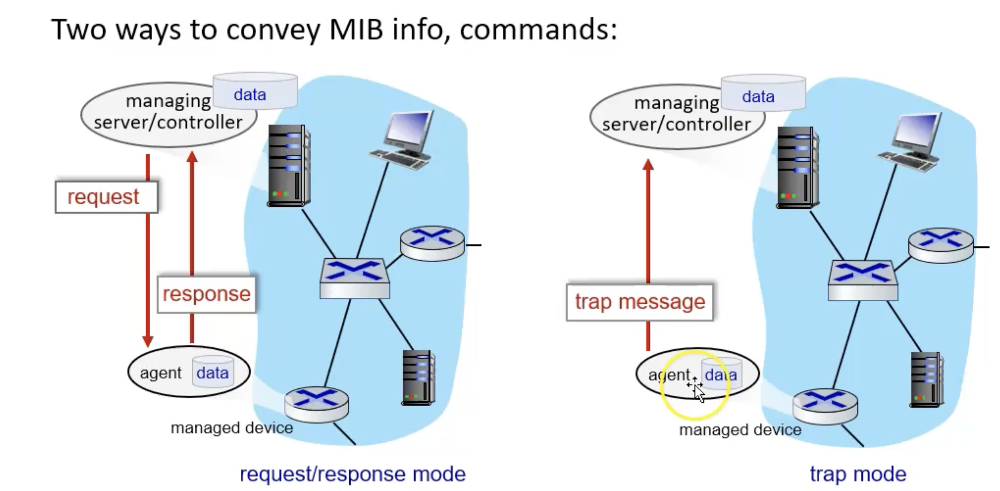

Computer networks
03-25-2025
### 5.2 Routing algorithms
The goal of any routing algo is to find "good paths" from the sending host to the receiver. But what does it mean to be good?

>Path: sequence of router packets going from source to destination

>Good: Could mean different things. Could mean the least "cost" path, "fastest" path, or even "least congested" path.

Graphs are used to show paths. This is the notation here. 

The link cost between two nodes that aren't connecting is infinity.
Routing algorithms can be defined by 4 things on a spectrum.
Whether or not they are global/decentralized or whether or not static/dynamic.

>Global: All routers have complete topology. They know what their costs are through link state algorithms.

>Decentralized: The calculation of link path is calculated iterative through each router 

---
>Static: Algorithm changes slowly over time

>Dynamic: Algorithm changes quickly over time

## Dijkstras link state algo:
- Centralized: Link cost known to ALL nodes and all nodes have the same info
- Lowest cost nodes are connected to all other nodes via forwarding table
- The algorithm complexity: O(n^2) average, O(nlogn) best
- The message complexity:  O(n)
Distance vector is another class of routing algorithms:

---
## Bellman-Ford Equation
The distance vector algorithm is based on the bellman-Ford equation:
	D$x$(y) = min $v$ { c $x,v$ + D $v$ (y) }   
- D$x$(y) is the cost of least cost path from x to y
- min $v$ is min taken over all neighbors v of x
- c $x,v$ is the direct cost of the link from x to v
Essentially each node sends its own distance vector estimates to each other and from there it is easy to find the least cost path

Each node of the Belleman-Ford algorithm follows the same 3 steps
1. Wait for change in local link cost or a message from its neighbors
2.  Recompute their distance vector estimates with new info (Is there now a cheaper path from a to b?)
3. If their Distance vector changes, let my neighbors know
If there is a link cost change:
- Then the node updates the routing info to other nodes, recalculates the local distance vectors and notifies their neighbors

## Open shortest path first (OSPF) routing 
OPSF paths are publicly available.
- They are NOT bounded by RFC and is the most used routing protocol as of the last 15 years.
- OSPF link state directly uses IP network to communicate with routers, meaning it doesn't use TCP/UDP networks.
- All OSPF messages are authenticated allowing for a level of security.
- OSPF networks know the topology of its entire network and thus uses Dijkstra's algorithm to compute its forwarding table.
In OSPS there is a two layer hierarchy: The local network and backbone

- Every OSPS network needs an area 0 which is considered the backbone of the network.
- In this example, areas 1 2 3 are all local networks and are also referred to as bordering routers
- The border routers share data gathered from neighboring networks and communicates it within its network
Multicast works
- One computer will send out an IP pack where it will go to all members of the multicast group. These members can go across routers.
Below are the classes of IP classes

## ICMP: Internet control message protocol 
- This is a protocol that lives on top of IP (it is a part of IP)
- This is considered "In band control". This is inside the IP protocol yet is important to the link layer.
- The source sends a set up UDP segments to destination and subsequently can find out all of the hosts along the way to the main host using TTL expirations.

Network management:
- There are different things network engineers would like to know about hosts within the network.
- Lets say you are a network manager: you would like to introduce redundancy in your more important networks. Redundancy ensures that if there were some error, port breaks, wire fails, etc. that your network will still be up and running.
- If there were no network management but there is redundancy. You want to know about outages and issues before users find out about it.
- NMS (network management station) - These could be included to solve different network problems in several different ways. One way is to regularly send out pings to each node in the network and see if it gets responses. If the pings doesn't get a response in a specific amount of time, it will tell the manager that there might be a problem. This is very very basic, checking if the machine is up. This uses ICMP
SNMP (simple network management protocol) - The client is a NMS and the server could be any process running SNMPD. Client asks server a question and gets an answer. 
- Examples of questions (structured and specific)
	- use things called a MIB (Message information base) and follows a formal data structure.
	- asks all sort of things about the devices
Several tools to approach management
- CLI (command line interface) - something like bash or cmd which will tell you all sorts of you things you need to know
- SNMP/MIB - operator questions to devices using SNMP
	- There are two ways to convey MIB info.
	1. Request response mode
	2. Trap mode

