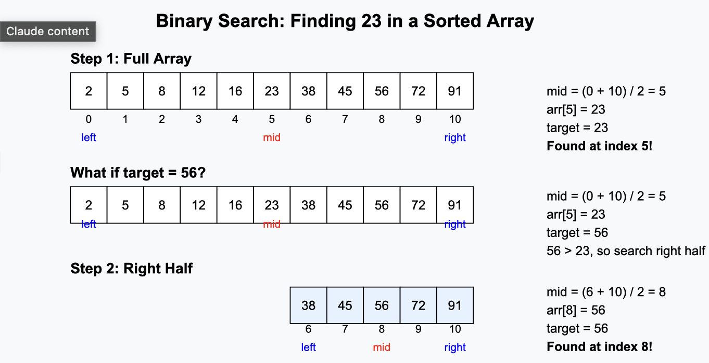

Data Structures
03-31-2025


>Binary search is a quick way to find a *SPECIFIC* item in a sorted list. It works very similar to a guessing game in the sense that the algorithm starts cutting the search area in half.

Things to note:
- The array MUST be sorted
- We always compare the middle value of the array to the target value
- If the target is less than the middle value, cut out the left half of the area and vice versa if the target is greater than the middle value
- Then this is repeated until the target value is found
### The time complexity of this algorityhm is O(logn)


Example of binary search to visualize:



How to implement binary search in your code:
``` cpp 
int binarySearch(int arr[], int size, int target)

{

int left = 0;

int right = size - 1;

while (left <= right)

{

// First, calculate middle index (avoiding integer overflow)

int mid = left + (right - left) / 2;

  

// Check if target is present at mid

if (arr[mid] == target)

return mid;

// If target greater, ignore left half

if (arr[mid] < target)

left = mid + 1; // Update left boundary

// If target smaller, ignore right half

else

right = mid - 1; // Update right boundary

}

// Target not present in array

return -1;

}
```


Examples of binary search uses:
- **Dictionary/Phone Book Lookups** - Finding a word or name quickly in an alphabetically sorted list
- **Database Systems** - Retrieving records from indexed databases
- **Finding Files** - Operating systems use it to locate files in directories
- **Auto-complete Features** - Suggesting words as you type in search engines or text editors
- **Library Systems** - Locating books by catalog number or ISBN
- **Version Control** - Git uses binary search to find commits that introduced bugs (git bisect)
- **Computer Games** - Finding the appropriate difficulty level based on player performance
- **IP Routing Tables** - Network routers use binary search to find the next hop for a packet
- **Spell Checkers** - Finding the closest correct word to a misspelled one
- **Compression Algorithms** - Finding patterns in data for compression

Main example (Square root of integers): 
	Find the square root of an integer. This will utilize the floor value if the answer isnt whole.
		i. e sqrt(8)-> 2
This works by making an array of values 1 - target value
[ 1, 2, 3, 4, 5, 6, 7, 8]
FIrst take the middle value and square it then see if it is less than, or greater than 8.
4$^2$ = 16: 16>8 so we get rid of everything on the right half of the array.
[ 1, 2, 3]
Now we repeat
2$^2$ = 4: 4<8 so discard the left half
[2, 3] 
(start with 3 end with 2)
3$^2$ = 9: 9 > 8 so discard right half. That just leaves 2 and therefore the loop ends and returns 2.

Another example (Count negative numbers in matrix):
	Given a matrix where each row and each column is sorted in non-increasing order, return the number of negative integers in the grid.
The logical approach to this is setting 0 to the target value and if the middle number is less than 0 then shift the index of the "mid" value to the left until middle !< 0.

