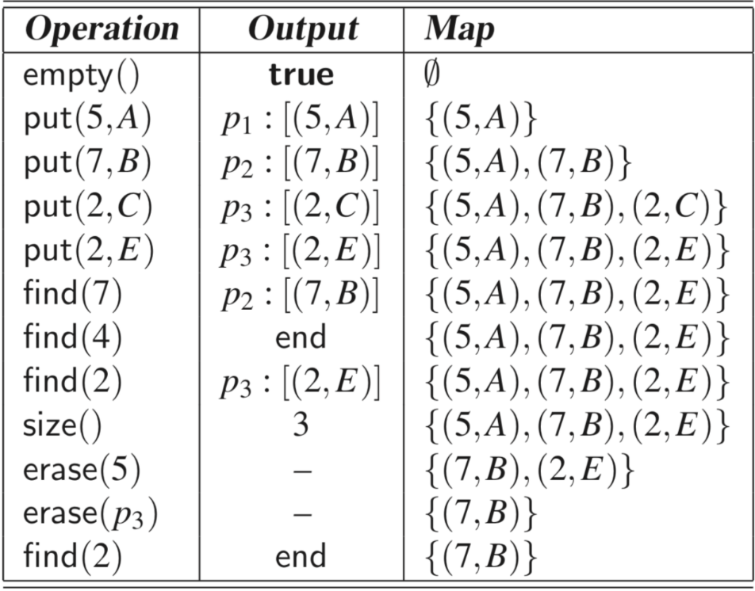
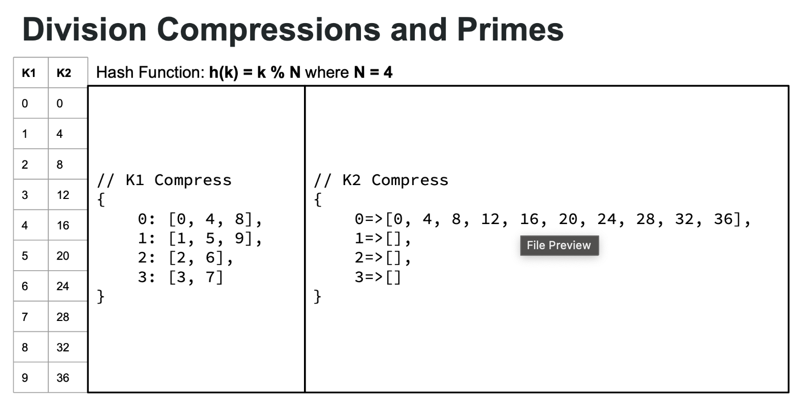

Data Structures
04-02-2025

They are very similar to dictionaries in python
>Map - structural collections of key value entries. Multipple entries with the same key in a map is NOT allowed.

In other words they store a key and a value.
Think of a phone book which has a name of a company (key) and the phone number (value).
Maps are useful for searching, inserting, and deleting items efficiently.
Applications:
- address book
- student-record databases
Coding example
```cpp
#include <map>

int main() {
    // Create a map of names and ages
    std::map<std::string, int> ages;
    
    // Add some people to our map
    ages["Bob"] = 25;
    ages["Alice"] = 22;
    ages["Charlie"] = 31;
    
    // Look up Charlie's age
    std::cout << "Charlie is " << ages["Charlie"] << " years old." << std::endl;
    
    return 0;
}
```

Documentation for maps:
find(k)
-  returns the entry with the key, k
put(k, v)
- if there is not an existing entry with the key k, then make a new entry [entry(k, v)]. If the key DOES exist, then update that keys value to v.
erase(k)
- If an entry with the key k exists, then remove it.
Example of these functions in action:


How do you initialize a map?
1. Include the map library 
```cpp
#include <map>
```
2. Similar to vectors you intialize a map with:
	- map <key type, value type> mapName= {"key", 5};
	```cpp
	map <std::string, int> people;
	people ["Bob"] = 25;
```

You can print values for a key in a map like:
```cpp
cout<<people["Bob"]<<endl;
```
---

How can we use hashtables with maps and what even is a hashmap?

>A hash table is a faster type of map. It uses a special math trick to find values quickly.

Imagine a library. Books are sorted by call numbers. The call number is created from the book's title using a math formula. This formula is a "hash function."

In other words a hash function is used to assign positions to items inside a map.

A hash table for a given key type consists of  
-  Hash function h  
- Array (called table) of size N

Example:
 We are to design a hash table to sort entries that go as (SSN (social security number), name) where SSN is a 9 digit positive integer. 
 The hash table uses an array of size N = 10,000 and the hash function:  
- **h(x) = last four digits of x**
Another way to think about it is a group of buckets where the hash function dumps entries into sequential buckets. Once everything is sorted, the time complexity of functions such as searches, insertions, or removals are O(n).

The downside is not every bucket may be used. This is an inefficient use of space.

To get around this we can use a Hash compression function.

--- 
**What Are Hash Compression Functions?**

> A hash compression function takes data of any size and squeezes it down to a fixed-size value.

Think of it like a juicer. You can put in different fruits (data) of different sizes, but you always get juice that fits in the same cup (hash value).

We use different methods. In the case of *Division Compressions and primes*, the formula is:
- ### *h$_2$ (y) = y mod N*

Here is an example:

K1 is essentailly the best case of this type of compression and K2 is an example of a bad case.

Collisions:
> Sometimes two items want the same spot. This is called a collision. Remember, ideally we would like one item to be in a unique "bucket".

To handle collisions we use Chaining.
- Chaining ensures that each spot in the table holds a list of items.
- Think of it like apartment mailboxes where each box might hold mail for multiple people.
The way it works is by looking at what buckets are empty and out of use. Then whichever item is causing collision will instead be dumped into an empty bucket.
## Memory Trick

"CHOP" method for remembering hash functions:

- **C**haining: Lists at each spot
- **H**ashing: Compressing big data to small indices
- **O**pen addressing: Look for another spot
- **P**rime numbers: Use prime table sizes to reduce collisions

In this example the Compression formula is h(k) = (3k + 3) mod 11
