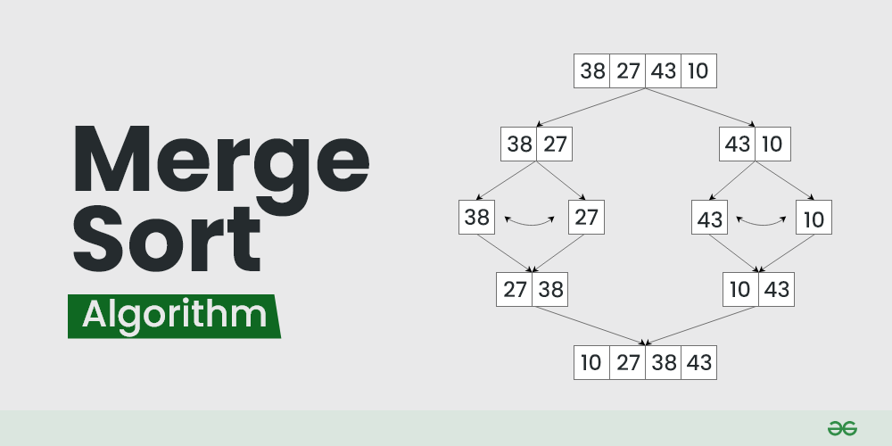

# "Devnotes"
 
## SPRING 2025 NOTES LOG

### 2025 2-28 notes
#### Markdown notes and basics

\#heading 1 is how you make a heading
You can have different indentations of headings (subheadings) if you use multiple ##

For italics you use * word * or you can use _ word _
like this *word* _word_.

For bold you use \*\*word** or you can use \_\_word__ 
like this **word** or __word__

For strikethrough you can use \~~word~~ 
like this ~~word~~

For block quote you use the \> operator at the beginning of a line

>Example of a comment or quote

For a link the text we want to go into the link is in brackets and the actual link itself into parantheses
 [Example link](https://github.com/baldiebaldie)


### 2025 3-03 Notes
#### Data structures (different types of sorting)
## Insertion sort
- It is the fastest of the slow approaches and works by
having a loop inside of a loop that looks at two entries which are next to each other and compares them. If the second element belongs where the first goes, then swap the two. The worst case time complexity would be O(n^2).

The code implementaion looks like this

``` cpp
void insertionSort(int arr[], int n)
{
    for (int i = 1; i < n; ++i) {
        int key = arr[i];
        int j = i - 1;
        /* Move elements of arr[0..i-1], that are
           greater than key, to one position ahead
           of their current position */
        while (j >= 0 && arr[j] > key) {
            arr[j + 1] = arr[j];
            j = j - 1;
        }
        arr[j + 1] = key;
    }
}   
```

Pros

* Simple to implement and understand
* Efficient for small datasets (< 20 elements)
* Adaptive: O(n) time when nearly sorted
* In-place: only requires O(1) extra space
* Stable: preserves order of equal elements
* Online: can sort as data arrives

Cons

* O(n²) time complexity makes it inefficient for large datasets
* Significantly slower than more advanced algorithms for large inputs

Example:


## Merge sort
1) Merge sort works by splitting the array into two equal halves 
2) Then the algorithm sorts the two smaller trees
3) Then they combine the two sorted arrays

Time complexity is O(n log n)

This is intuitive because the alogrithm splits the work into two n amount of times thus n log n.

The code implementation looks like this

``` c++
void merge(int arr[], int left, int mid, int right) {
    // Calculate sizes of the two subarrays
    int n1 = mid - left + 1;
    int n2 = right - mid;
    
    // Create temporary arrays
    int* L = new int[n1];
    int* R = new int[n2];
    
    // Copy data to temporary arrays
    for (int i = 0; i < n1; i++)
        L[i] = arr[left + i];
    for (int j = 0; j < n2; j++)
        R[j] = arr[mid + 1 + j];
    
    // Merge the temporary arrays back into arr[left..right]
    int i = 0;    // Initial index of first subarray
    int j = 0;    // Initial index of second subarray
    int k = left; // Initial index of merged subarray
    
    while (i < n1 && j < n2) {
        if (L[i] <= R[j]) {
            arr[k] = L[i];
            i++;
        } else {
            arr[k] = R[j];
            j++;
        }
        k++;
    }
    
    // Copy remaining elements of L[] if any
    while (i < n1) {
        arr[k] = L[i];
        i++;
        k++;
    }
    
    // Copy remaining elements of R[] if any
    while (j < n2) {
        arr[k] = R[j];
        j++;
        k++;
    }
    
    // Free allocated memory
    delete[] L;
    delete[] R;
}

void mergeSort(int arr[], int left, int right) {
    if (left < right) {
        // Find the middle point
        int mid = left + (right - left) / 2;
        
        // Sort first and second halves
        mergeSort(arr, left, mid);
        mergeSort(arr, mid + 1, right);
        
        // Merge the sorted halves
        merge(arr, left, mid, right);
    }
} 
```


The visual representation looks like this:



Pros

-    Consistent Performance: O(n log n) time complexity in all cases (best, average, worst)
- Stability: Preserves the relative order of equal elements
- External Sorting: Works well with external storage when dealing with large datasets
- Parallelization: Can be easily parallelized due to its divide-and-conquer nature
- Linked Lists: Very efficient for linked lists (requires only pointer manipulation, not extra space)
- Predictability: Performance doesn't depend on input data distribution

Cons

- Extra Space: Requires O(n) additional space for the temporary arrays
- Not In-Place: The standard implementation is not in-place
- Not Adaptive: Doesn't take advantage of partially sorted arrays
- Not Cache-Friendly: Can cause more cache misses than algorithms like quicksort
- Function Call Overhead: Recursive implementation has function call overhead
- Overkill for Small Arrays: For small arrays, simpler algorithms like insertion sort are faster


|      | Insertion sort | mMrge sort   |
| :---        |    :----:   |          ---: |
| Speed      | - fast for small sets O(n^2)      |- fast for overall O(n log n)  |
| Ease of use   | -  easy to implement        | - more difficult to implement  |

**The takeaway form these two sorting alogrithms so far is that insertion sort is earier to implement and better for smaller arrays while merge sort might be more difficult to implement but is significantly better/faster for larger data sets**


## Quick Sort [sort()]
Quicksort takes a divide and conquer approach to sorting.

1) sort() first selects a pivot, or an element to use.
2) Then the algorithm partitions the array into sections around the given pivot. The smaller elements will go to the left of the pivot and the larger elements go to the right of the pivot.
3) Then sort() applies the above steps recursively to the smaller arrays.

In other words, a pivot is selected and two subsequent sub arrays are made with the elements that are smaller than the pivot and one larger. Then the algorithm does this again recursively for each and every sub array until the array is fully sorted.

if you #include alogrithm then you can use quicksort like sort(). All you need to do is make a comparison funciton.

The comparison function looks like this:
``` cpp 
bool compare(int a, int b) 
{
    return a > b; // Sort in descending order
}

// Using function pointer
sort(vec.begin(), vec.end(), compare);

```

Visually the alogrithm looks like this: 


