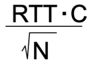
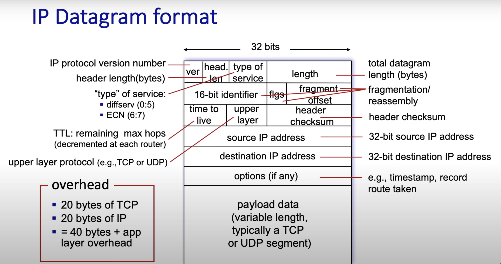

# "Devnotes"
 
## SPRING 2025 NOTES LOG

### 2025 2-28 notes
#### Markdown notes and basics

\#heading 1 is how you make a heading
You can have different indentations of headings (subheadings) if you use multiple ##

For italics you use * word * or you can use _ word _
like this *word* _word_.

For bold you use \*\*word** or you can use \_\_word__ 
like this **word** or __word__

For strikethrough you can use \~~word~~ 
like this ~~word~~

For block quote you use the \> operator at the beginning of a line

>Example of a comment or quote

For a link the text we want to go into the link is in brackets and the actual link itself into parantheses
 [Example link](https://github.com/baldiebaldie)


#
#
### 2025 3-03 Notes
#### Data structures (different types of sorting)
## Insertion sort
- It is the fastest of the slow approaches and works by
having a loop inside of a loop that looks at two entries which are next to each other and compares them. If the second element belongs where the first goes, then swap the two. The worst case time complexity would be O(n^2).

The code implementaion looks like this

``` cpp
void insertionSort(int arr[], int n)
{
    for (int i = 1; i < n; ++i) {
        int key = arr[i];
        int j = i - 1;
        /* Move elements of arr[0..i-1], that are
           greater than key, to one position ahead
           of their current position */
        while (j >= 0 && arr[j] > key) {
            arr[j + 1] = arr[j];
            j = j - 1;
        }
        arr[j + 1] = key;
    }
}   
```

Pros

* Simple to implement and understand
* Efficient for small datasets (< 20 elements)
* Adaptive: O(n) time when nearly sorted
* In-place: only requires O(1) extra space
* Stable: preserves order of equal elements
* Online: can sort as data arrives

Cons

* O(n²) time complexity makes it inefficient for large datasets
* Significantly slower than more advanced algorithms for large inputs

Example:


## Merge sort
1) Merge sort works by splitting the array into two equal halves 
2) Then the algorithm sorts the two smaller trees
3) Then they combine the two sorted arrays

Time complexity is O(n log n)

This is intuitive because the alogrithm splits the work into two n amount of times thus n log n.

The code implementation looks like this

``` c++
void merge(int arr[], int left, int mid, int right) {
    // Calculate sizes of the two subarrays
    int n1 = mid - left + 1;
    int n2 = right - mid;
    
    // Create temporary arrays
    int* L = new int[n1];
    int* R = new int[n2];
    
    // Copy data to temporary arrays
    for (int i = 0; i < n1; i++)
        L[i] = arr[left + i];
    for (int j = 0; j < n2; j++)
        R[j] = arr[mid + 1 + j];
    
    // Merge the temporary arrays back into arr[left..right]
    int i = 0;    // Initial index of first subarray
    int j = 0;    // Initial index of second subarray
    int k = left; // Initial index of merged subarray
    
    while (i < n1 && j < n2) {
        if (L[i] <= R[j]) {
            arr[k] = L[i];
            i++;
        } else {
            arr[k] = R[j];
            j++;
        }
        k++;
    }
    
    // Copy remaining elements of L[] if any
    while (i < n1) {
        arr[k] = L[i];
        i++;
        k++;
    }
    
    // Copy remaining elements of R[] if any
    while (j < n2) {
        arr[k] = R[j];
        j++;
        k++;
    }
    
    // Free allocated memory
    delete[] L;
    delete[] R;
}

void mergeSort(int arr[], int left, int right) {
    if (left < right) {
        // Find the middle point
        int mid = left + (right - left) / 2;
        
        // Sort first and second halves
        mergeSort(arr, left, mid);
        mergeSort(arr, mid + 1, right);
        
        // Merge the sorted halves
        merge(arr, left, mid, right);
    }
} 
```


The visual representation looks like this:


Pros

-    Consistent Performance: O(n log n) time complexity in all cases (best, average, worst)
- Stability: Preserves the relative order of equal elements
- External Sorting: Works well with external storage when dealing with large datasets
- Parallelization: Can be easily parallelized due to its divide-and-conquer nature
- Linked Lists: Very efficient for linked lists (requires only pointer manipulation, not extra space)
- Predictability: Performance doesn't depend on input data distribution

Cons

- Extra Space: Requires O(n) additional space for the temporary arrays
- Not In-Place: The standard implementation is not in-place
- Not Adaptive: Doesn't take advantage of partially sorted arrays
- Not Cache-Friendly: Can cause more cache misses than algorithms like quicksort
- Function Call Overhead: Recursive implementation has function call overhead
- Overkill for Small Arrays: For small arrays, simpler algorithms like insertion sort are faster


|      | Insertion sort | mMrge sort   |
| :---        |    :----:   |          ---: |
| Speed      | - fast for small sets O(n^2)      |- fast for overall O(n log n)  |
| Ease of use   | -  easy to implement        | - more difficult to implement  |

**The takeaway form these two sorting alogrithms so far is that insertion sort is earier to implement and better for smaller arrays while merge sort might be more difficult to implement but is significantly better/faster for larger data sets**


## Quick Sort [sort()]
Quicksort takes a divide and conquer approach to sorting.

1) sort() first selects a pivot, or an element to use.
2) Then the algorithm partitions the array into sections around the given pivot. The smaller elements will go to the left of the pivot and the larger elements go to the right of the pivot.
3) Then sort() applies the above steps recursively to the smaller arrays.

In other words, a pivot is selected and two subsequent sub arrays are made with the elements that are smaller than the pivot and one larger. Then the algorithm does this again recursively for each and every sub array until the array is fully sorted.

The time complexity of this alogrithm is O(n log n)

if you #include alogrithm then you can use quicksort like sort(). All you need to do is make a comparison funciton.

The comparison function looks like this:
``` cpp 
bool compare(int a, int b) 
{
    return a > b; // Sort in descending order
}

// Using function pointer
sort(vec.begin(), vec.end(), compare);

```

Visually the alogrithm looks like this: 


Pros

- Efficiency: O(n log n) average time complexity, often fastest in practice
- In-Place: Requires only O(log n) extra space for the recursion stack
- Cache Friendly: Works well with memory hierarchies due to good locality of reference
- Adaptive: Performance improves for partially sorted inputs with proper pivot selection
- Parallelizable: Can be implemented as a parallel algorithm
- Tail-Recursion: Can be optimized to use tail recursion
- Divide-and-Conquer: Breaks problem into smaller subproblems

Cons

- Worst-Case Performance: O(n²) time complexity in the worst case (when poorly pivoted)
- Not Stable: Does not preserve the relative order of equal elements
- Sensitive to Pivot Selection: Performance heavily depends on the choice of pivot
- Not Ideal for Linked Lists: Unlike merge sort, not efficient for linked lists
- Recursive Nature: Deep recursion can cause stack overflow for large datasets
- Not Well-Suited for Tiny Arrays: Insertion sort outperforms it for very small arrays


On the exam it is likely we will be given an example array of say 5 elements and give the pivot element and we will have to manually perform quick sort.

A great website to visuallty see this algorithm as well as practice for that question on the exam:  [www.hackerearth.com](https://www.hackerearth.com/practice/algorithms/sorting/quick-sort/visualize/?arrayValues=1%2C+3%2C+4%2C+8%2C+23)

#
#
### 2025 March 4th notes 
### Computer logic and design
## Sequential logic circuit block design


The diagram illustrates the fundamental structure of a sequential logic circuit with two main components:

Combinational Logic (blue box): Receives inputs labeled x₁ through xₙ and produces outputs z₁ through zₘ.
Memory (gray box): Stores the current state of the system.

The key feature of sequential circuits is the feedback loop, where:

Current state variables (y₁ through yᵣ) feed into the combinational logic
The combinational logic produces next state variables (Y₁ through Yᵣ)
These next state variables feed back into the memory element
The memory element then updates the current state for the next cycle

This feedback mechanism is what gives sequential circuits their "memory" capability, allowing them to make decisions based not just on current inputs (like combinational circuits) but also on previous inputs and states.

#
Here is a simple example problem here:
The example input is 011010


Note that the 1/1 means a few things in this state diagram. the first number indicates which number will cause a transition and the second number is what the output state will change to. For example if state z starts at 0 and starts at state B. If x = 1 then B transitions to A as well as changing the state of Z to 1.

Also note that the state can only change depending on the falling edge of the clock cycle. For example look at T3-T4, although it seems that the state from A will go to B although it goes to C.


## Latches


This indicates a S-R latch as well as the timing diagram. What this does is it flips the output each and every time. In the table below all of the circled states are considered stable.
A stable state can run the circuit again and again and the inputs as well as the outputs remain the exact same.

if we change the value but no change in output the state is stable. if we change in input value and the output value changes the state is unstable.


A gated S-R latch is a S-R latch with an additional enable input. If enable is 0 then the states stay the same, if 1 then they are allowed to change.

The next state equation becomes
Q^+ = SG + Q(R' + G')
Where G is the enable input

The way to include this "Gate" is to use 2 more NAND gates initially as well as the enable input.


There are such latches called a D latch which essentially makes sure that if S=1 then R=0 and if S=0 Then R=1. The will never be the same


Therefore, the condition S=R=1 will never happen.

Note: if G=0 the next state will always be the same. 
if G=1 then the output will always flip

This is also reffered to as the **"transparent latch"**.

## 2025 March 3/04/25 Computer networks
Section 4 network layer

Inside of a router it is designed such where there are input ports switch fabric and output ports.

The input port is designed left to right as such

1) **Line termination**. The phyiscal means of how data is being transfered into the input 
2) **The link layer protocol**. This could be IPv4, IPv6 ect. but is essentially the protocol used to transmit the data.

3) **Generalized forwarding**. How the router determines where to send the data.


### Destination based forwarding 
Destination based forwarding use forwarding tables to determine where to send the data. This usually works with each section having a specific range of binary values. If it falls within that value then the data will link to whichever given interface.

A faster way/workaround used is longest prefix mathcing which, instead of a given range, the forwarding number will be linked to whichever has the longest matching prefix.

### Switching fabric

- Transfers packet from input link to the appropriate output link.

- The fabric has a swithcing rate.

- If data is switched via a bus, skips the intermediate transfer between memeory and in turn, is faster. A packet only has to pass through the bus or the pack plane once.

### input port queueing

- If more packets arrive in a unit time than the switching fabric can output the inputs, then there is a queue. 

- **Head of the line blocking**: Packets at different input ports want to go to the same output port.

### Output port
- Essentially the same thing as the input port but flipped.
- There needs to be queuing if multiple packets arrive at the same time. 
- Scheduling dicipline: the router knows which packets that are queued should be prioritized for transmission.


**Buffering formula** 



TCP senders will be slower to detect

When packets are recieved out of order there are different types of packet scheduling. 

### Different types of packet scheduling

- FCFS scheudling is first in first out. 
- There are also priority queues. The network operator or the ISP is who gets to choose what is priority and what isn't.
- Round robin scheduling classifies packets into different classes and then is queued by class.  
- - In round robin queuing there is weighted fair queuing (WFQ) where each class can recieve a different amount of service according to the formula below. This ensures that there is at least some bandwidth gauranteed to each class.

- - 

Network Neutrality
ISPs should enable access to all content and applications regardless of the source w/o favoring or blocking a particular site

### The internet protocols
 IPv4 Datagram format
 


 IP addresses are 4 - 8 bit numbers

 xxxxxxxx - xxxxxxxx - xxxxxxxx - xxxxxxxx
 
 223.1.1.1 for example is:
 11011111 - 00000001 - 00000001 - 00000001


 