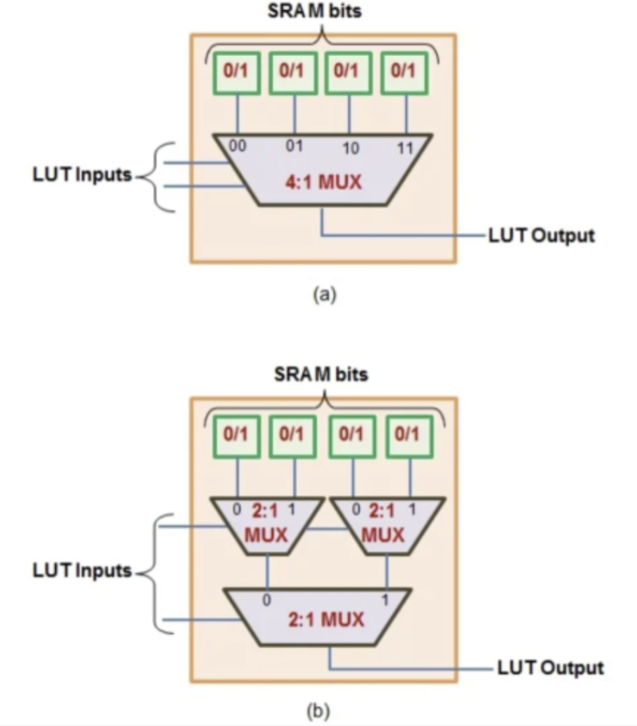
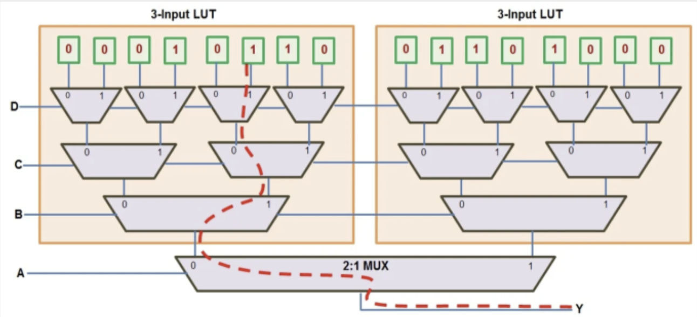
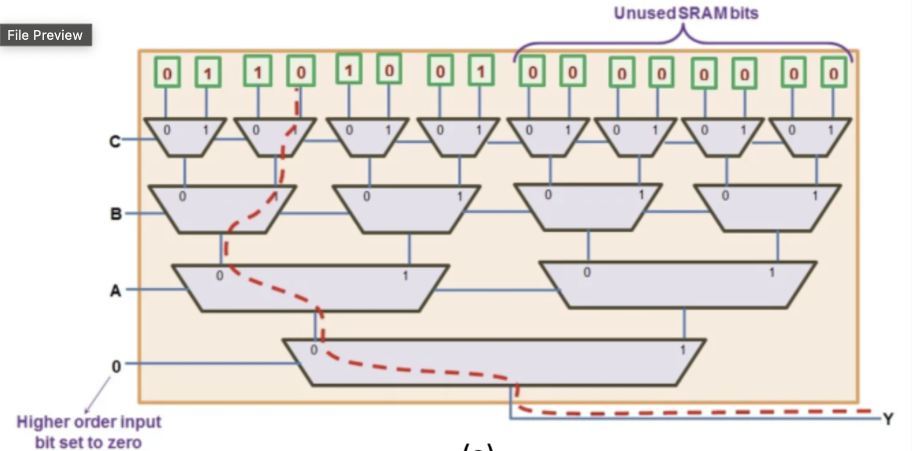

Computer Logic and Design
04-17-2025

>FPGAs - a device that contains a matrix of reconfigurable gate array logic circuitry

- Unlike processors FPGAs do not contain operating systems
- FPGAs are truly parallel in nature meaning they do not have to compete for the same resources. Therefore, they have better performance.
How are FPGAs different over PLAs and PALs?
FPGAs provides its user with a way to configure
1. the intersection between logic blocks
2. The function of each logic blocks 

# Look up tables (LUTs)
LUTs - an actual table that generates and output based on the inputs. 
- Every time you change the address pins you are changing the point at a different address entry. 
- Another way to think of LUTs are small pieces of RAM that is loaded whenever you power up your FPGA chip
- It defines and directs the behavior of the combinational logic of your chip based on your VHDL or Verilog code.  
- They also act like logic gates meaning that instead of having to connect a number of different NAND and NOR gates you can simply just connect a LUT to get all of the possible
- connections.   

An LUT with n inputs is seen to comprise of 2$^n$ single bit memory cells.
(Note that 2:1 MUXs can be used instead of 4:1 MUX because they are more modular)

There are multiple cases in which LUTs can be useful.

Case 1: N(Input Variables) = N(LUT Inputs)
Suppose we want to realize a Boolean Function of four input variables A, B, C and D using a 4-  
input LUT.

Case 2: N(Input Variables) > N(LUT Inputs)
- Two 3-input LUTs share the same set of three lower-significant inputs (B, C, and D).  
- The output from any one of these LUTs is routed onto the Y output bit (shown by a red  
discontinuous line) using a 2:1 mux whose select line will be our fourth variable, A (MSB).
Here we have more inputs (A,B,C,D) then we have available for our LUT. We can get around this by having another LUT to have the logic still work.

Case 3: N(Input Variables) < N(LUT Inputs)
- Three input variables constituting the Boolean expression drive the three (LSB) inputs of the  
LUT while its fourth input (MSB) will be pulled low.  
- 8 SRAM cells are configured to hold the output values of the function while the other eight  
cells are set to zeros.  
In this case we have more ports in our LUT than there are inputs so in this case we use one of the MUXs as 0 where only the left side will ever work because the MUX is just 0.

How do engineers approach making an FPGA?
1. System design: First they have to decide what portion of the functionality has to be implemented on FPGA. 
2. Design entry: Then the engineer has to design the functionality of the FPGA in an HDL such as Verilog. 
3. Simulation: After this step, the engineer must make sure that their design works as intended and uses simulations to make sure that everything works as intended. 
4. Synthesis: Next is synthesis where the engineer takes the first steps to make the FPGA hardware which results in a Netlist.
5. Place and route: The engineer then maps the logic physically on the FPGA which was described in the Netlist. The result of the route and process is called a bitstream, or the binary data that has to be loaded into the FPGA will allow the chip to run the HDL code.
6. Design verification: Finally then engineer will make sure that the bit stream file is ran to the FPGA and then makes sure it actually works and is ready to go