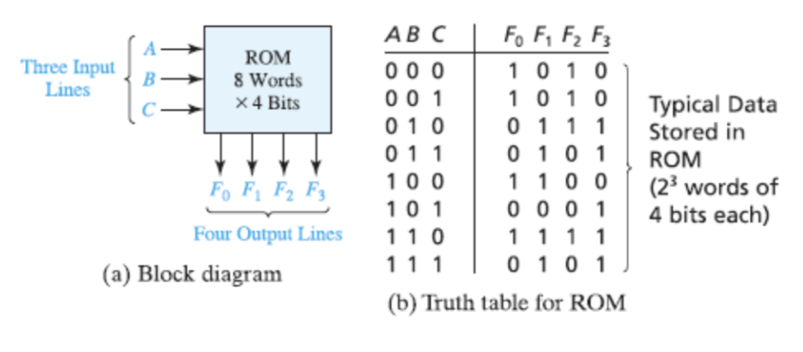
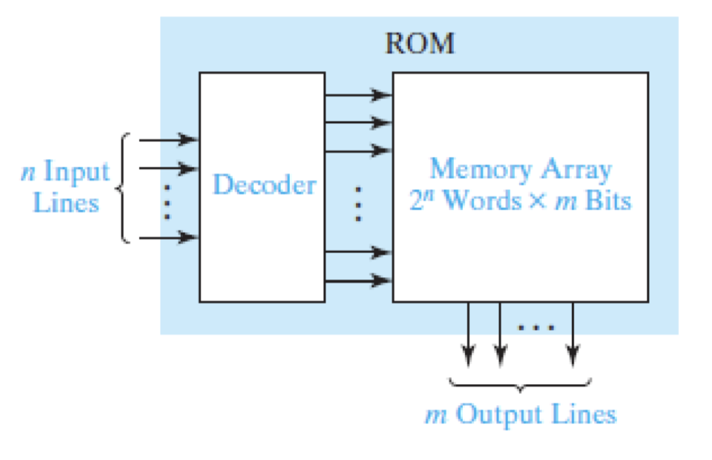
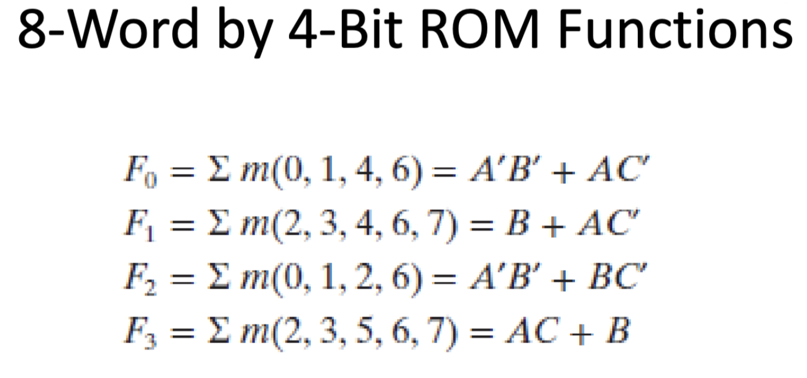
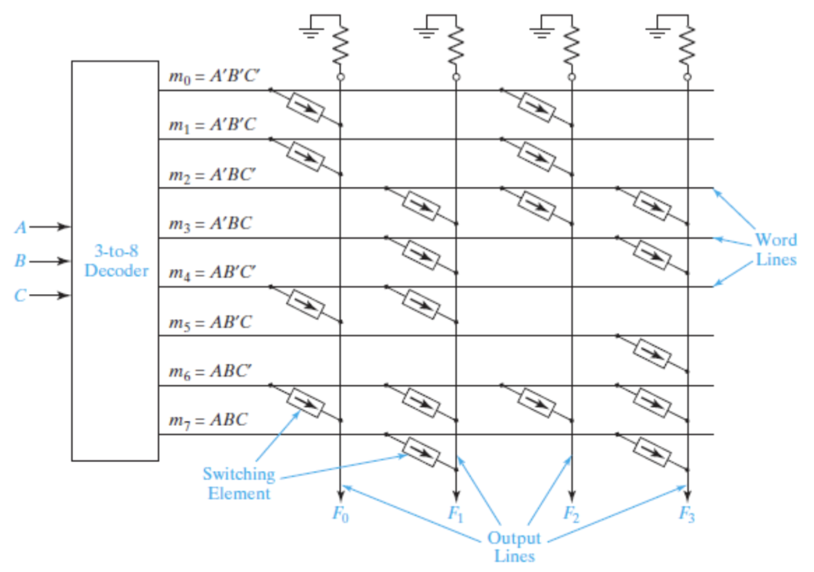
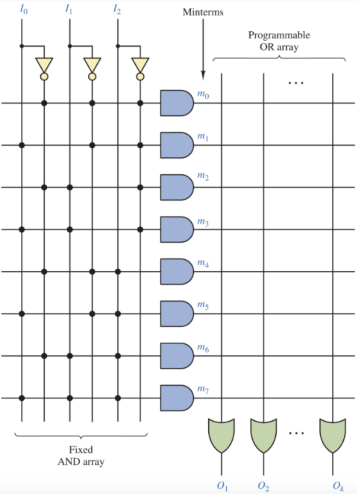
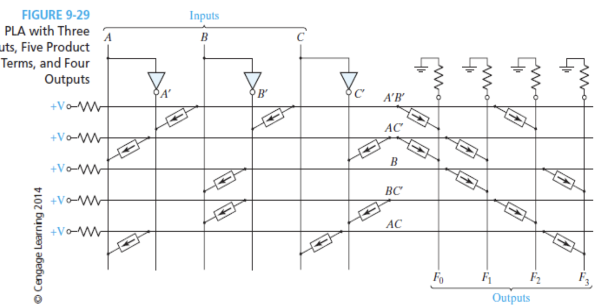
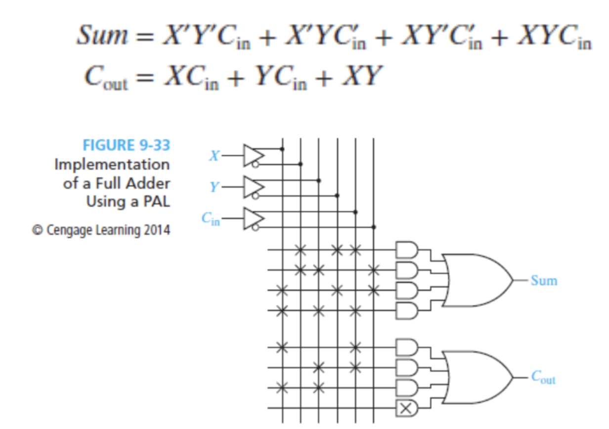

	Computer Logic and Design
04-15-2025

use programmable digital logic devices to reduce the number of circuit packages

PDL - Contain circuits that can be configured or programmed by a designer to realize logic functions that would otherwise take many logic gates.

One example of a PDL is ROM (Read-only memory)
- ROM has n input lines and m output lines which contains an array 2$^n$ words where each word is m bits long. 
### Types of ROM
1. PROM (programmable Read-only memory) - customizable and programmable (only once) with a PROM writer that vaporizes select diodes
2. EPROM is electrically reprogrammable after erasing all bits by ultraviolet  
light, then applying a high voltage to a floating gate MOS transistor  
(floating gate is a capacitor)  
3. EEPROM (flash memory) can have blocks of bits changed electrically by  
applying a high voltage to the non floating gate.  
8

### Read-Only memory (ROM) structure
A ROM essentially contains a decoder and memory array

Example problem:

### Programmable Read-Only memory (PROM)
Contains a fixed AND array and a fixed OR array.
So this looks like this:

### Programmable logic array (PLA)
PLA - performs the same basic functions as a ROM. A PLA has n inputs and m outputs
PLA diagram:

NOTE the main difference between PLAs and PROMs is that in PROMs the boolean functions are fixed, hard coded into the and gate, whereas in PLAs the boolean function is controllable by the user.

### Programmable Array Logic (PAL)
PAL - special case of the programmable logic array in which the AND array is programmable, and the OR array is fixed. This makes it so each or gate is connected to AT LEAST 4 and gates no matter if they are used or not.

PAL example diagram:
