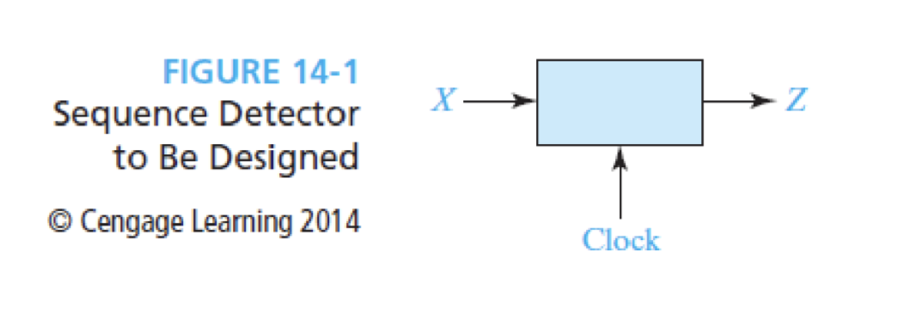
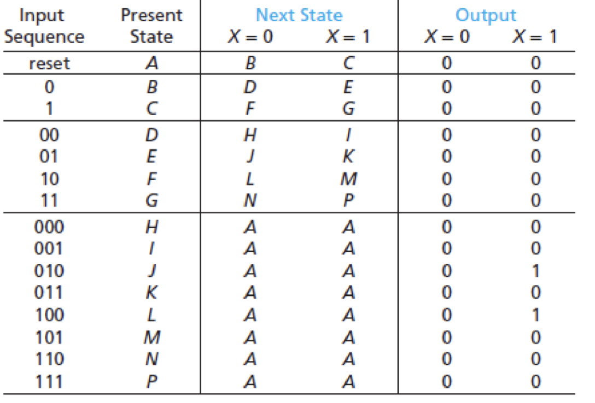
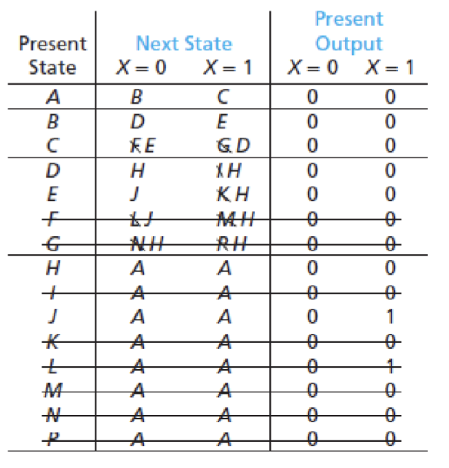
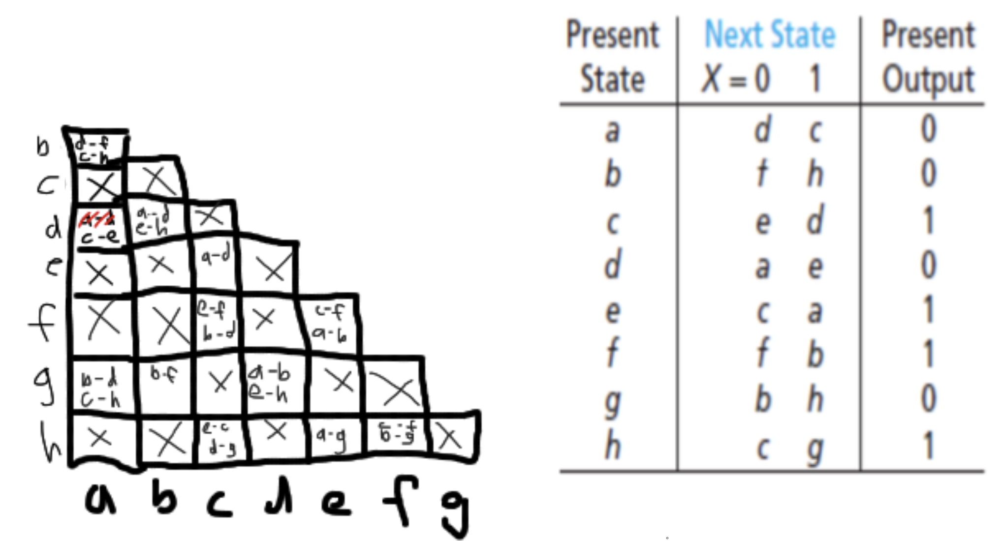
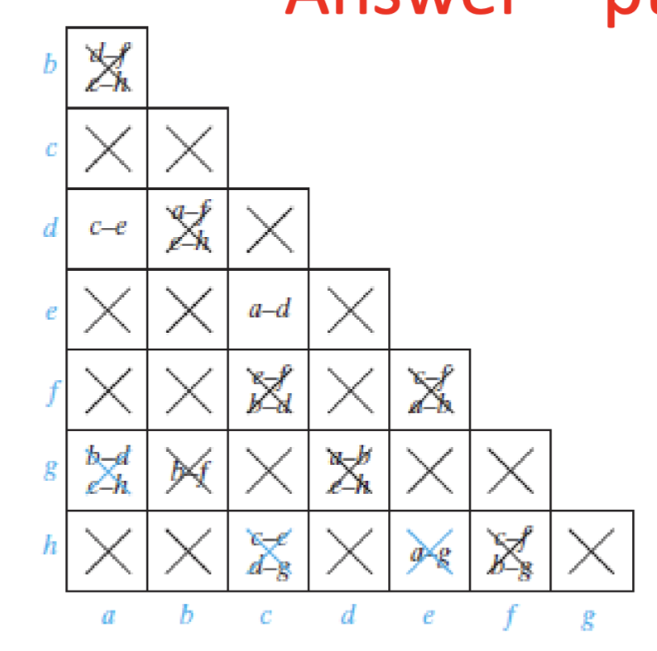
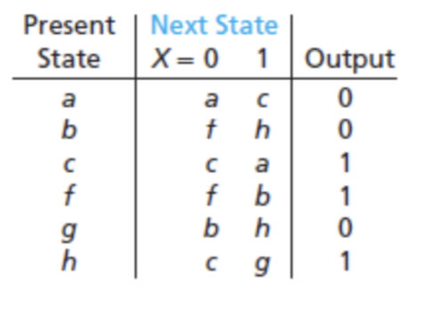
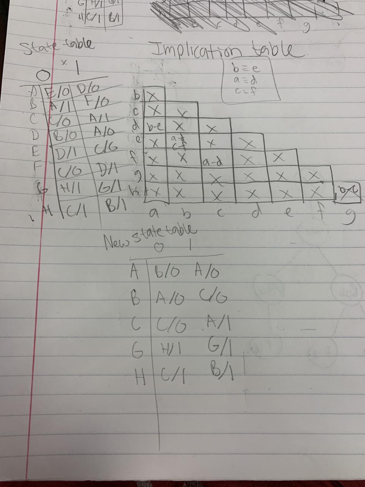

Computer Logic and Design
04-10-2025

Sequence detector: Looks at strrings of 0s and 1s. These are applied to the input X and output Y.

One method is eliminating redundant state.
In the example above, we can reduce through elmiminating redundant states
- H and I are indistinguishable.
- Similarly, rows K, M, N, and P can replaced by H and removed.
- After the first slew of replacements the new table might look like this
- Note here, after we replace I, K, L, M, N, P with H that rows F and G get changed and thus have more redundancies.
As a result of eliminating these redundancies, the circuit is easier to implement as well as more cost efficient to implement.

Another method is using An Implication table
>Implication table: A chart that contains a square for each pair of states

After you make the table, then compare each pair of rows in the state table.
 - If the outputs with states are different, place an X in the square to indicate those two state are not equal
 - If the outputs are the same, then place them in the same square
 Here is an example of, the implication table is on the left and the implication table is on the right
 
For two state to be equivalent their implied pair of states MUST BE equivalent
Now to evaluate the implication table you must:
3. Go through the table square-by-square. If square i-j contains the implied pair  
	m-n, and square m-n contains an X, then i  
	≢j, and an X should be placed in  
	square i-j.  
4. If any X’s were added in step 3, repeat step 3 until no more X’s are added.  
5. For each square i-j which does not contain an X, i≡j
The final, simplified chart with all the X's will look like this 
For this, we can conclude that C == E and that A == D so those states are redundant and thus a new reduced table can be made:

Note that d was removed and e was removed. In the next state column every occurrence of d is replaced with a and every occurrence of e is replaced with c.
