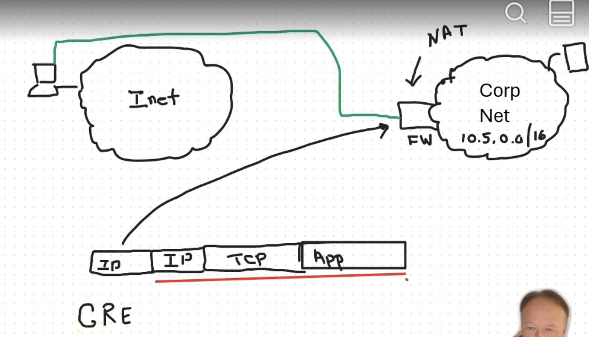

Computer networks
04-29-2025
#### VPNs and Firewalls
127.0.0.1 local ip is meant mainly for a computer to talk back with itself 

Let say you are on your computer connected to the internet trying to access work from your company who is also connected to the internet. You want to speak to a server within that network. For privacy purposes it is likely you will connect to your companies middle box (firewall for instance) through a tunnel instead of the internet.

>Tunnels - A virtual connection between your host to another host (can be a firewall) that is not through a network.

made by taking the datagram and wraps it inside an IP packet. This outside layer is removed through the firewall which reroutes the datagram to its destination. This is an example of a GRN (generic routing tunnel).

VPN (virtual private network) - almost always an encrypted connection to another organization
 - Its essentially a way to become a member of an encrypted private network, very similar to tunneling. Difference is VPNS authenticate("IPSec" / "Pre-Shared key" PSK which is essentially a password) and encrypt
 - Commercial VPNs encrypts all of your traffic (Most is encrypted anyways even without a VPN excluding DNS). All queries are hidden behind a different IP (makes searching things more private)
	 - Hides IP address
	 - GEO IP (Sites/Online content can be blocked in specific regions, commercial VPNs can get around that

Firewalls - Network security system that monitors and controls incoming and outgoing traffic for a network based on a set of security rules.

Lets say we want to allow someone to connect and access one end-host on our local router but not everything on our router. An example is from home if I want to use the USF library database, its reasonable for the school to let me access the digital library but deny me student financial databases. The way this works is the user will connect to a firewall. 
- Firewall might have pseudo packet command might be "Allow ANY to connect to IP = 131.247.89.89, DST TCP = 443 : Allow from IP = 13.1.247.80.80 , SRC TCP = 443" which then allows the host to connect to that IP on the router and that router . This is called a ***Packet Filtering Firewall***. Note that the firewall has to allow communication in both directions.
- Statefull firewalls - similar to other firewalls that tracks the ACKS and SYN ACKS of connections. This allows the firewall to understand the direction of incoming and outgoing packets in the network (increases security).
