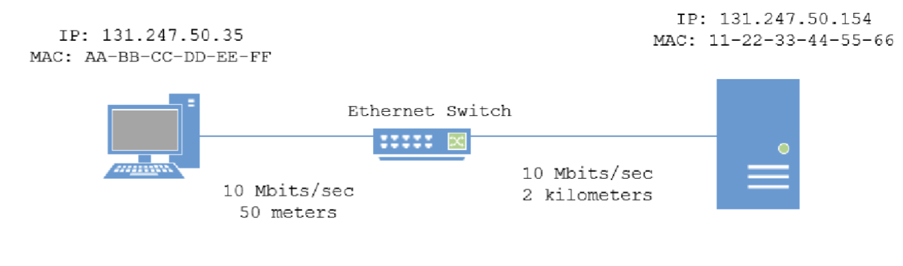
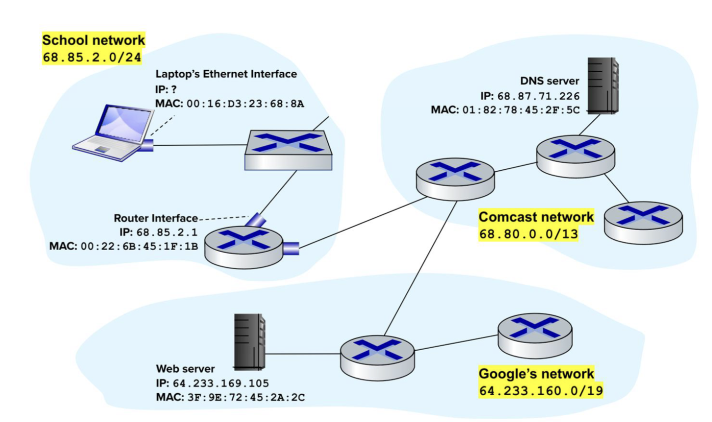

Computer networks
04-29-2025

Question 30 on spring 2024 practice exam:

Consider the following topology and answer the following two (2) questions. The two devices have not communicated in any way at the beginning of this question, but know each other's IP addresses. You may assume that all Ethernet frames are precisely 1500 bytes long. You should also assume that the Ethernet switch is a “store and forward” device. Assume that there is no queueing or processing time, and everything starts at time 0. 

30.) The PC on the left wants to perform a web connection to the server on the right. At what point in time will the PC “know” the MAC address of the server?

a. 2.406 ms  
b. 2.400 ms  
***c. 4.814 ms***  
d. Insufficient information to determine

(2(L/R) + 50/C) + (2(L/R) + (2000/C))
2(1500* 8/ 10 * 10^3) = 2.4
2.400 + 1.6 * 10^(-7 ) + 2.400 +  0.000066666 = 4.814

31.) When will the server fully receive the TCP SYN?
***a. 7.221 ms***  
b. 10.000 ms  
c. 9.627 ms  
d. Insufficient information to determine

1.5 * 4.814 = 7.221
note 4.814 is how long it takes info to get from host to server and back.

This is because once the initial ARP goes across and as it comes back we don't have to adjust L. Then as the SYN is constructed and transmitted, it is one more trip to the server. Hence 0.5+0.5+0.5 = 1.5 

Questions 32 and 33 use this information below:
Consider the diagram below. There are three autonomous systems. A new laptop connects to the school’s network for the first time via an Ethernet switch. The laptop’s user wishes to view the Web page at www.google.com. The school network uses Comcast ISP services to connect to Google’s network. Comcast’s network contains the local DNS server for the school network. A DHCP server lives in the school network’s gateway router and is able to allocate the unique IP address 68.85.2.101 to the incoming laptop. Under this context, please answer the following 12 questions split into 3 steps. Step 1: The incoming laptop tries to contact a DHCP server in the school network. To achieve this, it creates a DHCP Discover packet. Answer the following 4 questions for this step. 32. What destination IP address and destination port number does the DHCP Discover packet use? a. Destination IP 255.255.255.255, UDP Port 67 b. Destination IP 68.85.2.1, UDP Port 67 c. Destination IP 64.233.169.105, UDP Port 80 d. Destination IP 0.0.0.0, TCP Port 80 33. What source IP address does the DHCP Discover packet use? a. 68.85.2.101 b. 255.255.255.255 c. 0.0.0.0 d. FF-FF-FF-FF-FF-FF 

Step 1: The incoming laptop tries to contact a DHCP server in the school network. To achieve this, it creates a DHCP Discover packet. Answer the following 4 questions for this step.

32.) What destination IP address and destination port number does the DHCP Discover packet use?
***a. Destination IP 255.255.255.255, UDP Port 67***  (***This is correct bc it uses the correct Discover IP for a discover packet)***
b. Destination IP 68.85.2.1, UDP Port 67  
c. Destination IP 64.233.169.105, UDP Port 80  
d. Destination IP 0.0.0.0, TCP Port 80

33.)  What source IP address does the DHCP Discover packet use?  
a. 68.85.2.101  
b. 255.255.255.255  
***c. 0.0.0.0***  
d. FF-FF-FF-FF-FF-F

34.)What ‘broadcast’ destination address does the DHCP Discover packet’s Link Layer frame have?  
a. 255.255.255.255  
b. 0.0.0.0  
***c. FF-FF-FF-FF-FF-FF***  
d. 00-00-00-00-00-00

36.) DNS operates at the –  
***a. Application Layer***  
b. Transport Layer  
c. Network Layer  
d. Link Layer

37.) Which destination IP address and destination port number does the DNS query packet use? 
a. Destination IP 255.255.255.255, UDP Port 53  
***b. Destination IP 68.87.71.226, UDP Port 53***  (very obviously)
c. Destination IP 64.233.169.105, TCP Port 80  
d. Destination IP 0.0.0.0, TCP Port 80

38.) How will the laptop determine the MAC address of the default gateway router interface?  
a. DHCP already told the laptop the MAC address of the default gateway router interface  
***b. The laptop will use ARP to figure out the MAC address***  
c. The laptop will use IP Anycasting to figure out the MAC address  
d. The MAC address is globally unique, so the laptop only needs to Google it to look it up

39.) When the DNS query packet leaves the incoming laptop’s Ethernet interface, what destination  
MAC address will the frame use at the Link Layer?  
a. FF:FF:FF:FF:FF:FF  
***b. 00:22:6B:45:1F:1B***  (as it is transmitting off of its network IP addresses talk to each other.)
c. 01:82:78:45:2F:5C  
d. 3F:9E:72:45:2A:2C

#### SNMP
There is a management on the netwrok
the clients on the network typically run an agent
MIB - data structure that tells the manager how to interpret the information it gets from the client. 
