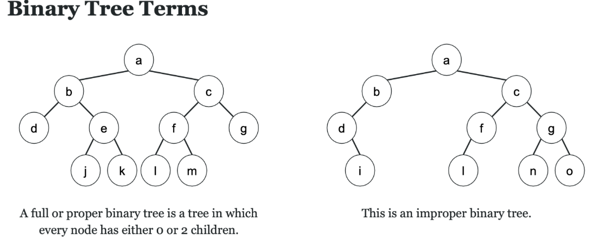
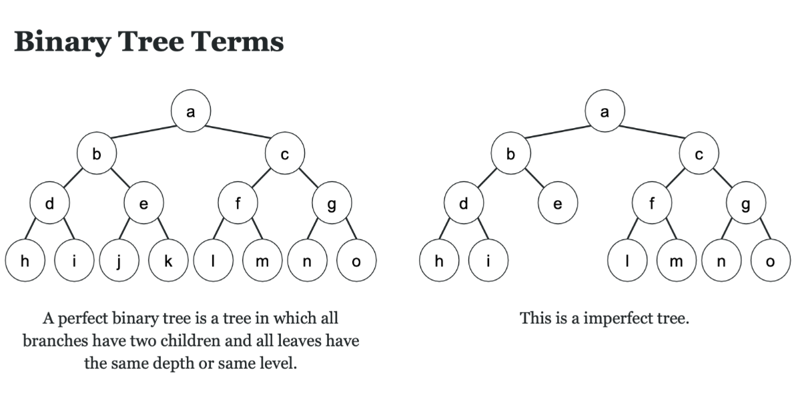
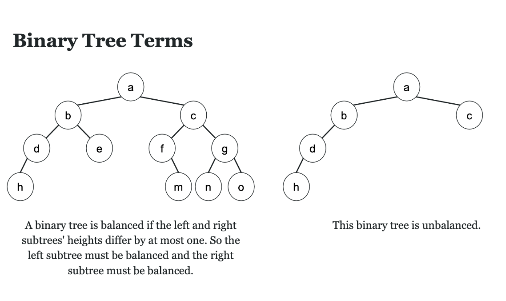
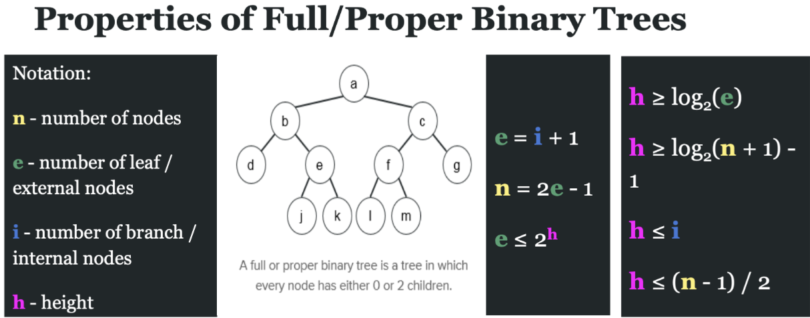

Data Structures
03-05-2025


[Youtube reference video](https://www.youtube.com/watch?v=1-l_UOFi1Xw)

- Trees are similar to a linked list but the main difference is nodes can connect to multiple different nodes therefore making a tree


The class for the node might look like this
``` cppp
class Node 
{
    int data;
    Node child1;
    Node child2;
    Node child3;
};
```
In the example above:

 1 would be the main node with the three children 9, 10, 2. 

2 becomes a parent node with -1, 5, 4

5 becomes a parent node with 4, 2 (Note this only has 2 child nodes so child3 would be set to NULL)

Also note that nodes that have no children have their children set to NULL. For example the node -1.


---


Another example of a tree is a binary tree which looks like this.
 
- The main differnce here is the nodes have at most 2 child nodes.

The class for this structre might look like this:

``` cppp
class Node 
{
    int data;
    Node left;
    Node right;
   
};

```

- binary trees have at most 2 children for each node

### Examples of what are considered trees and what isn't
---

---
- Note if multiple nodes connect to one node, then the structure IS NOT a tree (The bottom two examples)
- This is because from the root node there must be only unique paths to each node. If you were able to go two different paths from the root node to a node, then it is not a tree.


### Practice problem


**Answer**

```cpp
int findSum(root)
{
    if(root == NULL)
        return 0;
    else
        return root.value + findSum(root.left) + findSum(root.right);
}
```

In class notes 3/10/25

Binary trees are recursive definitions. Always think recursively when trying to implement a binary tree.
Binary tree terms:
	- Proper binary tree: Tree in which every node has either 0 or 2 children
 


	- Perfect binary tree - Tree where all trees have two children and all leaves the same depth or same level

- Complete binary tree - Every lateral level is completely filled except for possibly the last. All the nodes in the last level are as far left as possible
![[CompleteBinaryTree.png]]
Note that the tree on the right is not complete because the third level is not completely filled.
- Balanced binary tree - The left and rights subtrees heights differ by at most 1.

In this example, the height of the left subtree is 2 a->b->e and the right is 3 a->c->f->m so its balanced. 

>**Note there is 15 points on the exam between these four definitions
>**


